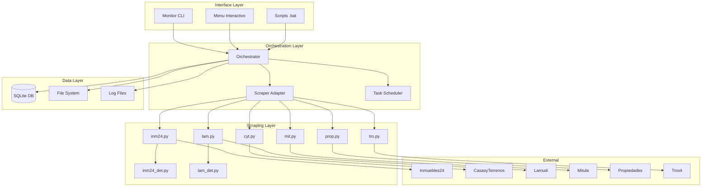

# 🏗️ Sistema de Orquestación de Scraping Inmobiliario

[](https://python.org)
[](https://ubuntu.com)
[](LICENSE)
[](https://github.com)

## 📋 Tabla de Contenidos

- [Descripción General](#-descripción-general)
- [Características Principales](#-características-principales)
- [Arquitectura del Sistema](#️-arquitectura-del-sistema)
- [Instalación](#-instalación)
- [Configuración](#️-configuración)
- [Uso](#-uso)
 - [Almacenamiento de Datos SQL](#-almacenamiento-de-datos-sql)
- [Monitoreo](#-monitoreo)
- [API y CLI](#-api-y-cli)
- [Desarrollo](#-desarrollo)
- [Troubleshooting](#-troubleshooting)
- [Contribución](#-contribución)
- [Licencia](#-licencia)

## 🎯 Descripción General

El **Sistema de Orquestación de Scraping Inmobiliario** es una plataforma empresarial que automatiza la extracción coordinada de datos inmobiliarios de múltiples sitios web mexicanos. Diseñado para operar 24/7 con alta confiabilidad, monitoreo en tiempo real y recuperación automática de errores.

### 🏘️ Sitios Web Soportados

| Sitio Web | Código | Detalle | Prioridad | Estado |
|-----------|--------|---------|-----------|---------|
| Inmuebles24 | `Inm24` | ✅ Sí | 1 (Alta) | ✅ Activo |
| CasasyTerrenos | `CyT` | ❌ No | 2 | ✅ Activo |
| Lamudi | `Lam` | ✅ Sí | 3 | ✅ Activo |
| Mitula | `Mit` | ❌ No | 4 | ✅ Activo |
| Propiedades.com | `Prop` | ❌ No | 5 | ✅ Activo |
| Trovit | `Tro` | ❌ No | 6 | ✅ Activo |

### 🌍 Cobertura Geográfica

**Zona Metropolitana de Guadalajara:**
- Guadalajara (`Gdl`)
- Zapopan (`Zap`) 
- Tlajomulco (`Tlaj`)
- Tlaquepaque (`Tlaq`)
- Tonalá (`Ton`)
- El Salto (`Salt`)

## ✨ Características Principales

### 🚀 **Orquestación Inteligente**
- **Ejecución paralela**: Hasta 8 scrapers simultáneos
- **Dependencias automáticas**: Scrapers de detalle esperan a principales
- **Priorización**: Orden de ejecución basado en importancia
- **Rate limiting**: Control de velocidad por sitio web

### 🛡️ **Confiabilidad Empresarial**
- **Reintentos automáticos**: Hasta 3 intentos por tarea fallida
- **Recuperación graceful**: Continúa operación aunque fallen scrapers
- **Timeout inteligente**: Previene procesos colgados
- **Aislamiento de fallos**: Un error no detiene el sistema

### 📊 **Monitoreo y Observabilidad**
- **Dashboard en tiempo real**: Estado visual del sistema
- **Métricas detalladas**: Tasas de éxito, tiempos, volúmenes
- **Alertas configurables**: Notificaciones por email/Slack
- **Historial completo**: Trazabilidad de todas las ejecuciones

### 💾 **Gestión de Datos**
- **Organización jerárquica**: Estructura estándar de carpetas
- **Versionado automático**: Control de versiones por ejecución
- **Backup programado**: Respaldo automático diario
- **Limpieza inteligente**: Archivos antiguos se comprimen/eliminan

### 🔧 **Facilidad de Uso**
- **Configuración YAML**: Parámetros centralizados
- **CLI rico**: Comandos intuitivos para todas las operaciones
- **Menu interactivo**: Interfaz amigable para usuarios no técnicos
- **Documentación integrada**: Ayuda contextual en todos los comandos

## 🏗️ Arquitectura del Sistema

### 📐 **Diagrama de Arquitectura**



### 🧩 **Componentes Principales**

#### **1. Orchestrator Core (`orchestrator.py`)**
- **Responsabilidad**: Coordinación central de todas las operaciones
- **Funciones**:
  - Gestión de lotes de ejecución
  - Control de concurrencia y recursos
  - Manejo de errores y reintentos
  - Interacción con base de datos

#### **2. Scraper Adapter (`improved_scraper_adapter.py`)**
- **Responsabilidad**: Integración de scrapers existentes
- **Funciones**:
  - Adaptación dinámica de scrapers legacy
  - Inyección de configuración
  - Normalización de salidas
  - Manejo de dependencias entre scrapers

#### **3. Monitor CLI (`monitor_cli.py`)**
- **Responsabilidad**: Interfaz de monitoreo y control
- **Funciones**:
  - Dashboard en tiempo real
  - Comandos de administración
  - Visualización de métricas
  - Generación de reportes

#### **4. System Validator (`validate_system.py`)**
- **Responsabilidad**: Validación y diagnóstico
- **Funciones**:
  - Verificación de dependencias
  - Validación de configuración
  - Diagnóstico de problemas
  - Generación de reportes de salud

### 🗄️ **Esquema de Base de Datos**

```sql
-- Tabla principal de tareas de scraping
CREATE TABLE scraping_tasks (
    id INTEGER PRIMARY KEY AUTOINCREMENT,
    scraper_name TEXT NOT NULL,           -- Nombre del scraper
    website TEXT NOT NULL,               -- Código del sitio web
    city TEXT NOT NULL,                  -- Código de ciudad
    operation TEXT NOT NULL,             -- Tipo de operación
    product TEXT NOT NULL,               -- Tipo de producto
    url TEXT NOT NULL,                   -- URL a scrapear
    order_num INTEGER NOT NULL,          -- Orden de ejecución
    status TEXT NOT NULL,                -- Estado actual
    attempts INTEGER DEFAULT 0,          -- Número de intentos
    max_attempts INTEGER DEFAULT 3,      -- Máximo de intentos
    created_at TIMESTAMP DEFAULT CURRENT_TIMESTAMP,
    started_at TIMESTAMP,
    completed_at TIMESTAMP,
    error_message TEXT,                  -- Mensaje de error
    execution_batch TEXT,                -- ID del lote
    output_path TEXT                     -- Ruta del archivo generado
);

-- Tabla de lotes de ejecución
CREATE TABLE execution_batches (
    id INTEGER PRIMARY KEY AUTOINCREMENT,
    batch_id TEXT UNIQUE NOT NULL,       -- ID único del lote
    month_year TEXT NOT NULL,            -- Período (Sep25)
    execution_number INTEGER NOT NULL,   -- Número de ejecución
    started_at TIMESTAMP DEFAULT CURRENT_TIMESTAMP,
    completed_at TIMESTAMP,
    total_tasks INTEGER,                 -- Total de tareas
    completed_tasks INTEGER DEFAULT 0,   -- Tareas completadas
    failed_tasks INTEGER DEFAULT 0,      -- Tareas fallidas
    status TEXT DEFAULT 'running'        -- Estado del lote
);

-- Índices para optimización
CREATE INDEX idx_tasks_status ON scraping_tasks(status);
CREATE INDEX idx_tasks_batch ON scraping_tasks(execution_batch);
CREATE INDEX idx_batches_date ON execution_batches(started_at);
```

## 🚀 Instalación

### 📋 **Requisitos del Sistema**

- **Sistema Operativo**: Ubuntu 24.04 LTS (64-bit)
- **Python**: 3.12 o superior
- **Memoria RAM**: Mínimo 4GB, recomendado 8GB
- **Espacio en Disco**: Mínimo 2GB libres
- **Conexión a Internet**: Estable para scraping

### ⚡ **Instalación Rápida**

```bash
# 1. Clonar o descargar el proyecto
cd "/home/esdata/Documents/GitHub/Esdata_710"

# 2. Configurar entorno Python
python3 -m venv venv
source venv/bin/activate
pip install -r requirements.txt

# 3. Verificar instalación
python3 validate_system.py

# 4. Ejecutar demostración
python3 orchestrator.py test
```

### 🔧 **Instalación Manual**

```bash
# 1. Verificar Python
python3 --version

# 2. Crear entorno virtual
python3 -m venv venv
source venv/bin/activate

# 3. Instalar dependencias
pip install -r requirements.txt

# 4. Crear directorios
mkdir -p logs temp backups

# 5. Configurar variables de entorno (opcional)
export SCRAPING_CONFIG_PATH="/home/esdata/Documents/GitHub/Esdata_710/config/config.yaml"

# 6. Inicializar base de datos
python3 orchestrator.py test
```

### 🔍 **Verificación de Instalación**

```bash
# Validación completa del sistema
python3 validate_system.py

# Test básico de funcionalidad
python3 orchestrator.py test

# Verificar configuración
python3 monitor_cli.py system
```

## ⚙️ Configuración

### 📄 **Archivo Principal: `config/config.yaml`**

```yaml
# Configuración de base de datos
database:
  path: "/home/esdata/Documents/GitHub/Esdata_710/orchestrator.db"
  backup_path: "/home/esdata/Documents/GitHub/Esdata_710/backups"
  backup_retention_days: 30

# Configuración de ejecución
execution:
  max_parallel_scrapers: 6              # Scrapers simultáneos
  retry_delay_minutes: 30               # Delay entre reintentos
  execution_interval_days: 15           # Frecuencia de ejecución
  rate_limit_delay_seconds: 3           # Delay entre requests
  max_retry_attempts: 3                 # Máximo de reintentos
  enable_auto_recovery: true            # Recuperación automática

# Configuración por sitio web
websites:
  Inm24:
    priority: 1                         # Orden de ejecución
    has_detail_scraper: true            # Tiene scraper de detalle
    rate_limit_seconds: 4               # Rate limiting específico
    max_pages_per_session: 100          # Límite de páginas
    user_agent: "Mozilla/5.0 (X11; Linux x86_64) AppleWebKit/537.36 (KHTML, like Gecko) Chrome/131.0.0.0 Safari/537.36"
  
  CyT:
    priority: 2
    has_detail_scraper: false
    rate_limit_seconds: 3
    max_pages_per_session: 150

# Configuración de monitoreo
monitoring:
  enable_metrics: true                  # Habilitar métricas
  enable_alerts: true                   # Habilitar alertas
  check_interval_seconds: 300           # Intervalo de verificación

# Configuración de logging
logging:
  level: "INFO"                         # Nivel de log
  max_file_size_mb: 50                  # Tamaño máximo de archivo
  backup_count: 3                       # Archivos de respaldo
```

### 🌐 **Configuración de URLs: `urls/`**

Cada scraper tiene su archivo CSV correspondiente:

**Formato estándar:**
```csv
PaginaWeb,Ciudad,Operacion,ProductoPaginaWeb,URL
CyT,Gdl,Ven,Dep,https://www.casasyterrenos.com/jalisco/guadalajara/departamentos/venta
CyT,Zap,Ven,Cas,https://www.casasyterrenos.com/jalisco/zapopan/casas/venta
```

**Archivos de configuración:**
- `cyt_urls.csv` → CasasyTerrenos
- `inm24_urls.csv` → Inmuebles24
- `lam_urls.csv` → Lamudi
- `mit_urls.csv` → Mitula
- `prop_urls.csv` → Propiedades.com
- `tro_urls.csv` → Trovit

### 🔐 **Variables de Entorno (Opcional)**

```bash
# Configuración avanzada
export SCRAPING_CONFIG_PATH=/path/to/config.yaml
export SCRAPING_LOG_LEVEL=DEBUG
export SCRAPING_MAX_WORKERS=8
export SCRAPING_RATE_LIMIT=2
```

## 🎮 Uso

### 🖥️ **Menu Interactivo (Recomendado)**

```bash
# Abrir menú principal
python3 monitor_cli.py status --detailed
```

**Opciones disponibles:**
1. Ver estado del sistema
2. Ejecutar scraping completo
3. Ver historial de ejecuciones
4. Ver información del sistema
5. Ver estadísticas
6. Test del sistema
7. Abrir carpeta de datos
8. Editar configuración

### 💻 **Línea de Comandos**

#### **Orquestador Principal**
```bash
# Ejecutar lote completo de scraping
python3 orchestrator.py run

# Ver estado actual (formato JSON)
python3 orchestrator.py status

# Crear archivos de ejemplo
python3 orchestrator.py setup

# Test básico del sistema
python3 orchestrator.py test

# Ingerir todos los CSV existentes (históricos) a tablas SQL
python3 orchestrator.py ingest-existing
```

#### **Monitor CLI**
```bash
# Estado actual del sistema
python3 monitor_cli.py status
python3 monitor_cli.py status --detailed

# Historial de ejecuciones
python3 monitor_cli.py history
python3 monitor_cli.py history --limit 20

# Tareas del último lote
python3 monitor_cli.py tasks
python3 monitor_cli.py tasks --batch-id Sep25_01

# Información del sistema
python3 monitor_cli.py system

# Estadísticas de rendimiento
python3 monitor_cli.py stats
python3 monitor_cli.py stats --days 60

# Ejecutar scraping inmediatamente
python3 monitor_cli.py run
```

#### **Validación del Sistema**
```bash
# Validación completa
python3 validate_system.py

# Validación específica
python3 validate_system.py --check dependencies
python3 validate_system.py --check configuration
python3 validate_system.py --check scrapers
```

### 🔄 **Flujo de Trabajo Típico**

#### **1. Preparación (Una vez)**
```bash
# Configurar entorno
python3 -m venv venv
source venv/bin/activate
pip install -r requirements.txt

# Personalizar URLs
nano urls/cyt_urls.csv
nano urls/inm24_urls.csv
# ... editar otros archivos

# Ajustar configuración
nano config/config.yaml
```

#### **2. Ejecución Regular**
```bash
# Opción A: Menu interactivo
python3 monitor_cli.py status --detailed

# Opción B: Comando directo
python3 orchestrator.py run

# Opción C: Monitoreo continuo
python3 monitor_cli.py status --detailed
```

#### **3. Análisis de Resultados**
```bash
# Ver resultados
python3 monitor_cli.py history

# Estadísticas
python3 monitor_cli.py stats

# Abrir datos
xdg-open data
```

## 📊 Monitoreo

## 🗄️ Almacenamiento de Datos SQL

Cada scraper produce un CSV con columnas propias (heterogéneas). No se fuerza un esquema unificado en una sola tabla; en su lugar:

### Estrategia
- Una tabla por scraper: `data_<scraper>` (configurable con `data_storage.table_prefix`).
- Columnas se crean dinámicamente en la primera ingestión.
- Si en ejecuciones futuras aparecen nuevas columnas, se añaden con `ALTER TABLE` (si `add_missing_columns: true`).
- Los tipos se almacenan inicialmente como `TEXT` para flexibilidad (futura detección opcional de tipos).
- Se registra cada archivo ingerido para evitar duplicados (`ingested_files`).
- Se mantiene metadata de columnas por scraper en `scraper_metadata` (JSON simple).

### Tablas Nuevas
```sql
CREATE TABLE ingested_files (
  id INTEGER PRIMARY KEY AUTOINCREMENT,
  scraper_name TEXT NOT NULL,
  website TEXT,
  source_file TEXT NOT NULL,
  table_name TEXT NOT NULL,
  rows_ingested INTEGER,
  ingested_at TIMESTAMP DEFAULT CURRENT_TIMESTAMP,
  batch_id TEXT,
  UNIQUE(scraper_name, source_file)
);

CREATE TABLE scraper_metadata (
  id INTEGER PRIMARY KEY AUTOINCREMENT,
  scraper_name TEXT NOT NULL UNIQUE,
  table_name TEXT NOT NULL,
  columns_json TEXT NOT NULL,
  last_updated TIMESTAMP DEFAULT CURRENT_TIMESTAMP
);
```

### Configuración (`config/config.yaml`)
```yaml
data_storage:
  enable_sql_ingest: true
  table_prefix: "data_"
  normalize_column_names: true
  add_missing_columns: true
  chunk_size: 1000
  track_ingested_files: true
  skip_if_exists: true
  store_metadata: true
  enforce_primary_key: false
  date_detection: false
```

### Flujo Automático
1. Scraper termina con éxito → se llama a `store_scraper_output`.
2. Se lee el CSV, normaliza columnas (lowercase, underscores, sin espacios).
3. Se crea la tabla si no existe (`data_<scraper>`).
4. Se agregan columnas nuevas detectadas.
5. Se insertan filas en chunks (`chunk_size`).
6. Se actualiza metadata (`scraper_metadata`).
7. Se marca archivo como ingerido (`ingested_files`).

### Reingestión Manual de Históricos
```bash
python3 orchestrator.py ingest-existing
```
Este comando recorre `data/` y trata de inferir el `scraper_name` del nombre del archivo (prefijo antes del primer `_`). Útil tras activar la función de ingestión por primera vez.

### Consultas Rápidas
```sql
-- Ver tablas de datos
.tables data_

-- Últimos archivos ingeridos
SELECT scraper_name, source_file, rows_ingested, ingested_at FROM ingested_files ORDER BY ingested_at DESC LIMIT 20;

-- Columnas registradas para un scraper
SELECT columns_json FROM scraper_metadata WHERE scraper_name='cyt';
```

### Buenas Prácticas
- Mantén los CSV como fuente de verdad histórica (no borrar inmediatamente).
- Para análisis cruzado crea vistas materializadas posteriores con un subconjunto común de campos.
- Si un scraper empieza a producir IDs estables, puede activarse en el futuro `enforce_primary_key` para añadir índices.

### Próximas Extensiones (Roadmap)
- Detección de tipos (enteros, fechas) y migración suave.
- Índices configurables por scraper (ej. `precio`, `ciudad`).
- Compresión automática de CSV tras ingestión exitosa.

Si necesitas normalización unificada (wide table) se puede diseñar un ETL secundario sin tocar la ingestión bruta.

### 🔄 Ejemplo Pipeline Dual (Inm24)

1. Fase URL (scraper `inm24.py` en modo URL):
  - El orquestador ejecuta `inm24` y crea un archivo con patrón: `Inm24URL_<Ciudad>_<Operacion>_<Producto>_<MesAño>_<Exec>.csv`.
  - Columnas mínimas: `source_scraper,website,city,operation,product,listing_url,collected_at`.
2. Fase Detalle (scraper `inm24_det.py`):
  - Generado dinámicamente solo si el sitio tiene `has_detail_scraper: true`.
  - El adapter inyecta `SCRAPER_URL_LIST_FILE` apuntando al archivo *_URL_*.
  - `inm24_det.py` lee `listing_url` y produce archivo final `Inm24_<Ciudad>_<Operacion>_<Producto>_<MesAño>_<Exec>.csv` enriquecido.
3. Ingestión SQL:
  - Ambos archivos (URL y detalle) pueden ingerirse: se crean tablas `data_inm24` (para detalle) y también se puede crear `data_inm24url` si se desea separar (actualmente se usa misma convención por scraper principal; para diferenciar podría añadirse un postfijo futuro).
4. Requisitos de robustez:
  - Si falta el archivo *_URL_* el orquestador marca la tarea detalle como FAILED antes de ejecutar.
  - `inm24_det.py` crea placeholder si no encuentra lista (salida suave controlada).

Variables de entorno relevantes (inyectadas):
```
SCRAPER_MODE=url|detail
SCRAPER_OUTPUT_FILE=/ruta/al/archivo/final.csv
SCRAPER_WEBSITE=Inm24
SCRAPER_CITY=Gdl
SCRAPER_OPERATION=Ven
SCRAPER_PRODUCT=Dep
SCRAPER_BATCH_ID=Sep25_01
SCRAPER_URL_LIST_FILE=/ruta/al/archivo/Inm24URL_Gdl_Ven_Dep_Sep25_01.csv (solo en modo detalle)
```

Esto facilita extender a `Lam` repitiendo el mismo patrón sin reescribir orquestación.

### 📥 Fuente de Tareas: Archivos *_urls.csv

Cada archivo `<scraper>_urls.csv` en la carpeta `urls/` define explícitamente las combinaciones a ejecutar:

Columnas requeridas:
```
PaginaWeb,Ciudad,Operacion,ProductoPaginaWeb,URL
```
Ejemplo (`inm24_urls.csv`):
```
PaginaWeb,Ciudad,Operacion,ProductoPaginaWeb,URL
Inm24,Gdl,Ven,Dep,https://www.inmuebles24.com/departamentos-en-venta-en-pagina-1.html
Inm24,Zap,Ven,Dep,https://www.inmuebles24.com/departamentos-en-venta-en-zapopan-pagina-1.html
```

Para cada fila el orquestador crea una tarea y pasa la columna `URL` al adaptador como `SCRAPER_INPUT_URL`. El scraper en modo URL genera el archivo *_URL_* aplicando paginación incremental: reemplaza `pagina-<n>` o añade sufijos si corresponde, deteniéndose cuando no aparecen nuevos enlaces.

Beneficios de este modelo:
- Control explícito de combinaciones (evita lógica harcodeada dentro del scraper).
- Fácil activar/desactivar ciudades modificando un CSV.
- Escalable a más productos/operaciones sin cambiar código.

Si en un futuro se requiere parametrizar el número máximo de páginas por fila, se puede añadir una columna opcional `MaxPaginas` y el adaptador podría exponerla como variable de entorno adicional.

### 🎯 **Dashboard en Tiempo Real**

```bash
# Dashboard interactivo
python3 monitor_cli.py status --detailed
```

**Información mostrada:**
- Estado actual del sistema
- Progreso de lotes en ejecución
- Tareas completadas/fallidas/pendientes
- Tiempo de ejecución
- Errores recientes

### 📈 **Métricas del Sistema**

#### **Métricas de Rendimiento**
- **Tasa de éxito**: Porcentaje de tareas completadas exitosamente
- **Tiempo promedio**: Duración media de ejecución por scraper
- **Throughput**: Número de páginas procesadas por minuto
- **Volumen de datos**: Cantidad de registros extraídos

#### **Métricas de Calidad**
- **Reintentos**: Número promedio de reintentos por tarea
- **Errores**: Tipos y frecuencia de errores
- **Cobertura**: Porcentaje de URLs procesadas exitosamente

#### **Métricas del Sistema**
- **Uso de CPU**: Porcentaje de utilización
- **Uso de memoria**: RAM consumida por el sistema
- **Espacio en disco**: Almacenamiento utilizado
- **Conexiones de red**: Estado de conectividad

### 🚨 **Sistema de Alertas**

#### **Alertas Automáticas**
- **Fallo crítico**: Más del 50% de scrapers fallando
- **Tiempo excedido**: Ejecución tomando más de 2 horas
- **Espacio insuficiente**: Menos de 1GB de espacio libre
- **Error de conectividad**: Problemas de red persistentes

#### **Configuración de Alertas**
```yaml
# En config.yaml
monitoring:
  alerts:
    email:
      enabled: true
      smtp_server: "smtp.gmail.com"
      recipients: ["admin@empresa.com"]
    
    slack:
      enabled: false
      webhook_url: "https://hooks.slack.com/..."
    
    thresholds:
      failure_rate: 0.5              # 50% de fallos
      execution_time_hours: 2        # 2 horas máximo
      disk_space_gb: 1               # 1GB mínimo
```

### 📋 **Reportes Automáticos**

#### **Reporte Diario**
```bash
# Generar reporte del día
python3 monitor_cli.py stats --days 1 > reports/daily_$(date +%Y%m%d).txt
```

#### **Reporte Semanal**
```bash
# Generar reporte semanal
python3 monitor_cli.py stats --days 7 > reports/weekly_$(date +%Y%m%d).txt
```

#### **Reporte de Salud del Sistema**
```bash
# Generar reporte completo
python3 validate_system.py > reports/health_$(date +%Y%m%d).txt
```

## 🔌 API y CLI

### 🖥️ **Interfaz de Línea de Comandos (CLI)**

#### **Orchestrator CLI**
```bash
# Sintaxis general
python3 orchestrator.py <comando> [opciones]

# Comandos disponibles
Commands:
  run      Ejecutar lote completo de scraping
  status   Mostrar estado actual (JSON)
  setup    Crear archivos de configuración ejemplo
  test     Ejecutar test básico del sistema

# Ejemplos
python3 orchestrator.py run
python3 orchestrator.py status | jq '.last_batch'
python3 orchestrator.py test --verbose
```

#### **Monitor CLI**
```bash
# Sintaxis general
python3 monitor_cli.py <comando> [opciones]

# Comandos de estado
monitor_cli.py status [--detailed]
monitor_cli.py system
monitor_cli.py tasks [--batch-id BATCH]

# Comandos de historial
monitor_cli.py history [--limit N]
monitor_cli.py stats [--days N] [--website SITE]

# Comandos de control
monitor_cli.py run
```

### 📡 **API Interna (Para Desarrollo)**

#### **Orchestrator API**
```python
from orchestrator import WindowsScrapingOrchestrator

# Crear instancia
orch = WindowsScrapingOrchestrator()

# Ejecutar scraping
success = orch.run_execution_batch()

# Obtener estado
status = orch.get_status_report()

# Configurar scraper específico
task_info = {
    'scraper_name': 'cyt',
    'website': 'CyT',
    'city': 'Gdl',
    'operation': 'Ven',
    'product': 'Dep',
    'url': 'https://example.com'
}
```

#### **Monitor API**
```python
from monitor_cli import ScrapingMonitorWindows

# Crear monitor
monitor = ScrapingMonitorWindows()

# Mostrar estado
monitor.show_status(detailed=True)

# Mostrar estadísticas
monitor.show_stats(days=30)

# Ejecutar scraping
monitor.run_now()
```

#### **Database API**
```python
import sqlite3
from pathlib import Path

# Conectar a base de datos
db_path = Path("orchestrator.db")
conn = sqlite3.connect(db_path)
conn.row_factory = sqlite3.Row

# Consultar tareas
cursor = conn.execute("""
    SELECT * FROM scraping_tasks 
    WHERE status = 'completed' 
    ORDER BY completed_at DESC
""")
tasks = cursor.fetchall()

# Consultar estadísticas
cursor = conn.execute("""
    SELECT website, COUNT(*) as total,
           SUM(CASE WHEN status = 'completed' THEN 1 ELSE 0 END) as success
    FROM scraping_tasks
    GROUP BY website
""")
stats = cursor.fetchall()
```

### 🔧 **Códigos de Salida**

| Código | Significado | Acción |
|--------|-------------|---------|
| 0 | Éxito | Operación completada correctamente |
| 1 | Error general | Verificar logs y configuración |
| 2 | Error de configuración | Revisar config.yaml |
| 3 | Error de dependencias | Ejecutar `pip install -r requirements.txt` |
| 4 | Error de base de datos | Verificar permisos y espacio |
| 5 | Error de red | Verificar conectividad |

## 🛠️ Desarrollo

### 🏗️ **Arquitectura de Desarrollo**

#### **Estructura de Módulos**
```
src/
├── core/
│   ├── orchestrator.py          # Motor principal
│   ├── task_manager.py          # Gestión de tareas
│   ├── database.py              # Abstracción de DB
│   └── config.py                # Gestión de configuración
├── adapters/
│   ├── scraper_adapter.py       # Adaptador base
│   ├── cyt_adapter.py           # Adaptador específico CyT
│   └── inm24_adapter.py         # Adaptador específico Inm24
├── monitoring/
│   ├── metrics.py               # Recolección de métricas
│   ├── alerting.py              # Sistema de alertas
│   └── dashboard.py             # Dashboard web (futuro)
├── utils/
│   ├── logging.py               # Utilidades de logging
│   ├── validation.py            # Validaciones
│   └── helpers.py               # Funciones auxiliares
└── tests/
    ├── unit/                    # Tests unitarios
    ├── integration/             # Tests de integración
    └── e2e/                     # Tests end-to-end
```

### 🧪 **Testing**

#### **Tests Unitarios**
```python
# tests/unit/test_orchestrator.py
import unittest
from unittest.mock import Mock, patch
from core.orchestrator import WindowsScrapingOrchestrator

class TestOrchestrator(unittest.TestCase):
    def setUp(self):
        self.orchestrator = WindowsScrapingOrchestrator()
    
    def test_generate_batch_id(self):
        batch_id, month_year, exec_num = self.orchestrator.generate_batch_id()
        self.assertRegex(batch_id, r'^[A-Z][a-z]{2}\d{2}_\d{2}$')
    
    def test_load_urls_from_csv(self):
        # Mock CSV file
        with patch('pandas.read_csv') as mock_csv:
            mock_csv.return_value = Mock()
            tasks = self.orchestrator.load_urls_from_csv('cyt')
            self.assertIsInstance(tasks, list)

# Ejecutar tests
python -m pytest tests/unit/ -v
```

#### **Tests de Integración**
```python
# tests/integration/test_scraper_integration.py
import unittest
from pathlib import Path
from improved_scraper_adapter import ImprovedScraperAdapter

class TestScraperIntegration(unittest.TestCase):
    def setUp(self):
        self.base_dir = Path("test_data")
        self.adapter = ImprovedScraperAdapter(self.base_dir)
    
    def test_cyt_scraper_adaptation(self):
        task_info = {
            'scraper_name': 'cyt',
            'website': 'CyT',
            'city': 'Gdl',
            'operation': 'Ven',
            'product': 'Dep',
            'url': 'https://test.com',
            'output_file': 'test_output.csv'
        }
        
        result = self.adapter.adapt_and_execute_scraper(task_info)
        self.assertTrue(result)

# Ejecutar tests
python -m pytest tests/integration/ -v
```

#### **Tests End-to-End**
```python
# tests/e2e/test_complete_workflow.py
import unittest
import subprocess
from pathlib import Path

class TestCompleteWorkflow(unittest.TestCase):
    def test_complete_scraping_workflow(self):
        # Test setup → validation → execution → monitoring
        
        # 1. Setup
        result = subprocess.run(['python', 'orchestrator.py', 'setup'], 
                              capture_output=True, text=True)
        self.assertEqual(result.returncode, 0)
        
        # 2. Validation
        result = subprocess.run(['python', 'validate_system.py'], 
                              capture_output=True, text=True)
        self.assertEqual(result.returncode, 0)
        
        # 3. Execution
        result = subprocess.run(['python', 'orchestrator.py', 'run'], 
                              capture_output=True, text=True)
        self.assertEqual(result.returncode, 0)
        
        # 4. Monitoring
        result = subprocess.run(['python', 'monitor_cli.py', 'status'], 
                              capture_output=True, text=True)
        self.assertEqual(result.returncode, 0)

# Ejecutar tests
python -m pytest tests/e2e/ -v --slow
```

### 🔧 **Extensión del Sistema**

#### **Agregar Nuevo Sitio Web**

**1. Crear Scraper:**
```python
# Scrapers/nuevo_sitio.py
import pandas as pd
from bs4 import BeautifulSoup
import requests

def scrape_page_source(html):
    # Lógica de extracción específica
    pass

def main():
    # Lógica principal del scraper
    pass

if __name__ == "__main__":
    main()
```

**2. Configurar en YAML:**
```yaml
# config/config.yaml
websites:
  NuevoSitio:
    priority: 7
    has_detail_scraper: false
    rate_limit_seconds: 2
    max_pages_per_session: 50
```

**3. Crear URLs:**
```csv
# urls/nuevo_sitio_urls.csv
PaginaWeb,Ciudad,Operacion,ProductoPaginaWeb,URL
NuevoSitio,Gdl,Ven,Dep,https://nuevo-sitio.com/guadalajara/departamentos
```

**4. Registrar en Adaptador:**
```python
# improved_scraper_adapter.py
self.scraper_configs['nuevo_sitio'] = {
    'has_main': True,
    'url_parameter': 'URL_BASE',
    'output_method': 'save',
    'needs_url_modification': True
}
```

#### **Agregar Nueva Funcionalidad de Monitoreo**

```python
# monitoring/custom_metrics.py
class CustomMetricsCollector:
    def collect_custom_metrics(self):
        """Recolectar métricas personalizadas"""
        metrics = {}
        
        # Ejemplo: Métrica de velocidad de scraping
        metrics['pages_per_minute'] = self.calculate_scraping_speed()
        
        # Ejemplo: Métrica de calidad de datos
        metrics['data_quality_score'] = self.calculate_data_quality()
        
        return metrics
    
    def calculate_scraping_speed(self):
        # Implementar cálculo
        pass
    
    def calculate_data_quality(self):
        # Implementar cálculo
        pass
```

### 📝 **Guías de Contribución**

#### **Estándares de Código**
- **PEP 8**: Seguir estándares de estilo Python
- **Type Hints**: Usar anotaciones de tipo
- **Docstrings**: Documentar todas las funciones públicas
- **Testing**: Cobertura mínima del 80%

#### **Proceso de Desarrollo**
1. **Fork** del repositorio
2. **Crear rama** para la funcionalidad: `git checkout -b feature/nueva-funcionalidad`
3. **Desarrollar** con tests incluidos
4. **Ejecutar tests**: `python -m pytest`
5. **Validar código**: `python3 validate_system.py`
6. **Commit** con mensaje descriptivo
7. **Push** y crear **Pull Request**

## 🔧 Troubleshooting

### 🚨 **Problemas Comunes**

#### **Error: "Base de datos no encontrada"**
```
Síntoma: SQLite database not found
Causa: Primera ejecución o base de datos corrupta
Solución:
1. python3 orchestrator.py run    # Crea DB automáticamente
2. Verificar permisos de escritura en directorio
3. Si persiste: eliminar orchestrator.db y re-ejecutar
```

#### **Error: "Scraper no encontrado"**
```
Síntoma: FileNotFoundError: Scraper not found
Causa: Archivo .py faltante o ruta incorrecta
Solución:
1. Verificar existencia: python3 monitor_cli.py system
2. Validar estructura: dir Scrapers\
3. Re-descargar scrapers faltantes
```

#### **Error: "Dependencias faltantes"**
```
Síntoma: ModuleNotFoundError: No module named 'X'
Causa: Librerías Python no instaladas
Solución:
1. pip install -r requirements.txt
2. python -m pip install --upgrade pip
3. Si persiste: crear nuevo entorno virtual
```

#### **Error: "Archivo CSV no válido"**
```
Síntoma: CSV parsing error o columnas faltantes
Causa: Formato incorrecto en archivos de URLs
Solución:
1. Verificar formato: usar Excel o editor de texto
2. Validar columnas requeridas:
   - PaginaWeb, Ciudad, Operacion, ProductoPaginaWeb, URL
3. Recrear archivos: python3 orchestrator.py setup
```

#### **Error: "Chrome driver not found"**
```
Síntoma: WebDriverException: chromedriver not found
Causa: ChromeDriver no instalado o desactualizado
Solución:
1. Instalar Chrome: wget -q -O - https://dl.google.com/linux/linux_signing_key.pub | sudo apt-key add - && sudo apt-get update && sudo apt-get install google-chrome-stable
2. Instalar ChromeDriver: sudo apt-get install chromium-chromedriver
3. Alternativa: usar seleniumbase auto-download
4. Verificar instalación: which chromedriver
```

#### **Error: "Rate limit exceeded"**
```
Síntoma: Too many requests o 429 HTTP error
Causa: Scraping demasiado rápido
Solución:
1. Aumentar delay: config.yaml → rate_limit_delay_seconds
2. Reducir scrapers paralelos: max_parallel_scrapers
3. Verificar robots.txt del sitio web
```

#### **Error: "Timeout en scraper"**
```
Síntoma: Process timeout o hung scraper
Causa: Página web lenta o problema de red
Solución:
1. Aumentar timeout: config.yaml → timeout_minutes
2. Verificar conectividad: ping sitio-web.com
3. Revisar logs: type logs\orchestrator.log
```

#### **Error: "Espacio insuficiente"**
```
Síntoma: Disk space error o cannot write file
Causa: Disco lleno o permisos insuficientes
Solución:
1. Liberar espacio: ejecutar cleanup
2. Verificar permisos de escritura
3. Cambiar ubicación: editar paths en config.yaml
```

### 🩺 **Diagnóstico Avanzado**

#### **Diagnóstico Completo del Sistema**
```bash
# Ejecutar diagnóstico completo
python3 validate_system.py > diagnostico.txt 2>&1

# Verificar logs detallados
python3 monitor_cli.py system

# Test de conectividad
ping www.inmuebles24.com
ping www.casasyterrenos.com

# Verificar recursos del sistema
python -c "import psutil; print(f'CPU: {psutil.cpu_percent()}%, RAM: {psutil.virtual_memory().percent}%')"
```

#### **Logs de Debug**
```bash
# Activar logging detallado
export PYTHONPATH="$PYTHONPATH:/home/esdata/Documents/GitHub/Esdata_710"
python -c "
import logging
logging.basicConfig(level=logging.DEBUG)
from orchestrator import WindowsScrapingOrchestrator
orch = WindowsScrapingOrchestrator()
orch.run_execution_batch()
"

# Ver logs en tiempo real
tail -f logs/orchestrator.log
```

#### **Análisis de Performance**
```python
# performance_analyzer.py
import time
import psutil
from pathlib import Path

def analyze_performance():
    start_time = time.time()
    start_memory = psutil.virtual_memory().used
    
    # Ejecutar operación
    import subprocess
    result = subprocess.run(['python', 'orchestrator.py', 'run'], 
                          capture_output=True, text=True)
    
    end_time = time.time()
    end_memory = psutil.virtual_memory().used
    
    print(f"Tiempo de ejecución: {end_time - start_time:.2f} segundos")
    print(f"Memoria utilizada: {(end_memory - start_memory) / 1024**2:.2f} MB")
    print(f"Código de salida: {result.returncode}")

if __name__ == "__main__":
    analyze_performance()
```

### 🆘 **Recuperación de Emergencia**

#### **Restaurar desde Backup**
```bash
# Ubicar último backup
ls -la backups/

# Restaurar base de datos
cp backups/scraping_backup_YYYYMMDD_HHMMSS.tar.gz .
tar -xzf scraping_backup_YYYYMMDD_HHMMSS.tar.gz
cp scraping_backup_YYYYMMDD_HHMMSS/orchestrator.db .

# Verificar restauración
python3 monitor_cli.py status
```

#### **Reset Completo del Sistema**
```bash
# CUIDADO: Esto eliminará todos los datos
echo "Esta operación eliminará todos los datos. ¿Continuar? (y/N)"
read confirm
if [ "$confirm" = "y" ] || [ "$confirm" = "Y" ]; then
    rm -rf data logs temp backups
    rm -f orchestrator.db
    python3 -m venv venv
    source venv/bin/activate
    pip install -r requirements.txt
    echo "Sistema reseteado completamente"
fi
```

#### **Modo de Emergencia (Solo Monitoreo)**
```bash
# Ejecutar solo monitoreo sin scraping
python3 monitor_cli.py status
python3 monitor_cli.py system
python3 monitor_cli.py history --limit 10

# Verificar integridad de datos
python -c "
import sqlite3
conn = sqlite3.connect('orchestrator.db')
cursor = conn.execute('PRAGMA integrity_check')
print(cursor.fetchall())
"
```

### 📞 **Soporte Técnico**

#### **Información para Reportar Problemas**
```bash
# Generar reporte completo para soporte
echo "=== REPORTE DE SOPORTE ===" > soporte.txt
echo "Fecha: $(date)" >> soporte.txt
echo "" >> soporte.txt

echo "=== INFORMACIÓN DEL SISTEMA ===" >> soporte.txt
lsb_release -a >> soporte.txt 2>/dev/null
python3 --version >> soporte.txt
echo "" >> soporte.txt

echo "=== VALIDACIÓN DEL SISTEMA ===" >> soporte.txt
python3 validate_system.py >> soporte.txt 2>&1
echo "" >> soporte.txt

echo "=== ÚLTIMOS LOGS ===" >> soporte.txt
grep -E "ERROR|CRITICAL" logs/orchestrator.log | tail -20 >> soporte.txt
echo "" >> soporte.txt

echo "=== ESTADO ACTUAL ===" >> soporte.txt
python3 monitor_cli.py status >> soporte.txt 2>&1

echo "Reporte generado en soporte.txt"
```

#### **Contacto de Soporte**
- **Email**: soporte@scraping-system.com
- **Documentación**: [docs.scraping-system.com](https://docs.scraping-system.com)
- **GitHub Issues**: [github.com/proyecto/issues](https://github.com/proyecto/issues)
- **Slack**: #soporte-scraping

## 📚 Recursos Adicionales

### 📖 **Documentación Técnica**
- [Guía de Arquitectura](docs/ARCHITECTURE.md)
- [API Reference](docs/API.md)
- [Database Schema](docs/DATABASE.md)
- [Deployment Guide](docs/DEPLOYMENT.md)

### 🎓 **Tutoriales**
- [Tutorial: Primer Scraping](docs/tutorials/FIRST_SCRAPING.md)
- [Tutorial: Agregar Sitio Web](docs/tutorials/ADD_WEBSITE.md)
- [Tutorial: Configuración Avanzada](docs/tutorials/ADVANCED_CONFIG.md)

### 🔗 **Enlaces Útiles**
- [Python Official Documentation](https://docs.python.org/)
- [Selenium Documentation](https://selenium-python.readthedocs.io/)
- [BeautifulSoup Documentation](https://www.crummy.com/software/BeautifulSoup/bs4/doc/)
- [Pandas Documentation](https://pandas.pydata.org/docs/)

## 📄 Licencia

Este proyecto está licenciado bajo la Licencia MIT - ver el archivo [LICENSE](LICENSE) para detalles.

```
MIT License

Copyright (c) 2025 Sistema de Orquestación de Scraping Inmobiliario

Permission is hereby granted, free of charge, to any person obtaining a copy
of this software and associated documentation files (the "Software"), to deal
in the Software without restriction, including without limitation the rights
to use, copy, modify, merge, publish, distribute, sublicense, and/or sell
copies of the Software, and to permit persons to whom the Software is
furnished to do so, subject to the following conditions:

The above copyright notice and this permission notice shall be included in all
copies or substantial portions of the Software.

THE SOFTWARE IS PROVIDED "AS IS", WITHOUT WARRANTY OF ANY KIND, EXPRESS OR
IMPLIED, INCLUDING BUT NOT LIMITED TO THE WARRANTIES OF MERCHANTABILITY,
FITNESS FOR A PARTICULAR PURPOSE AND NONINFRINGEMENT. IN NO EVENT SHALL THE
AUTHORS OR COPYRIGHT HOLDERS BE LIABLE FOR ANY CLAIM, DAMAGES OR OTHER
LIABILITY, WHETHER IN AN ACTION OF CONTRACT, TORT OR OTHERWISE, ARISING FROM,
OUT OF OR IN CONNECTION WITH THE SOFTWARE OR THE USE OR OTHER DEALINGS IN THE
SOFTWARE.
```

---

## 🤝 Contribución

¡Las contribuciones son bienvenidas! Por favor lee [CONTRIBUTING.md](CONTRIBUTING.md) para conocer nuestro código de conducta y el proceso para enviar pull requests.

### 👥 **Colaboradores**

- **Desarrollador Principal**: [Tu Nombre](mailto:tu@email.com)
- **Arquitecto de Sistema**: [Colaborador](mailto:colaborador@email.com)
- **Especialista en Scraping**: [Especialista](mailto:especialista@email.com)

### 🙏 **Agradecimientos**

- Comunidad Python por las excelentes librerías
- Selenium y BeautifulSoup por hacer posible el web scraping
- Todos los contribuidores que han ayudado a mejorar este proyecto

---

**¿Necesitas ayuda?** 
- 📧 Email: soporte@scraping-system.com
- 💬 Slack: #soporte-scraping
- 📖 Documentación: [docs.scraping-system.com](https://docs.scraping-system.com)

**¡Feliz Scraping! 🚀**
