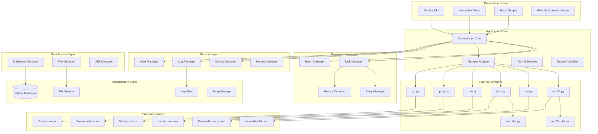
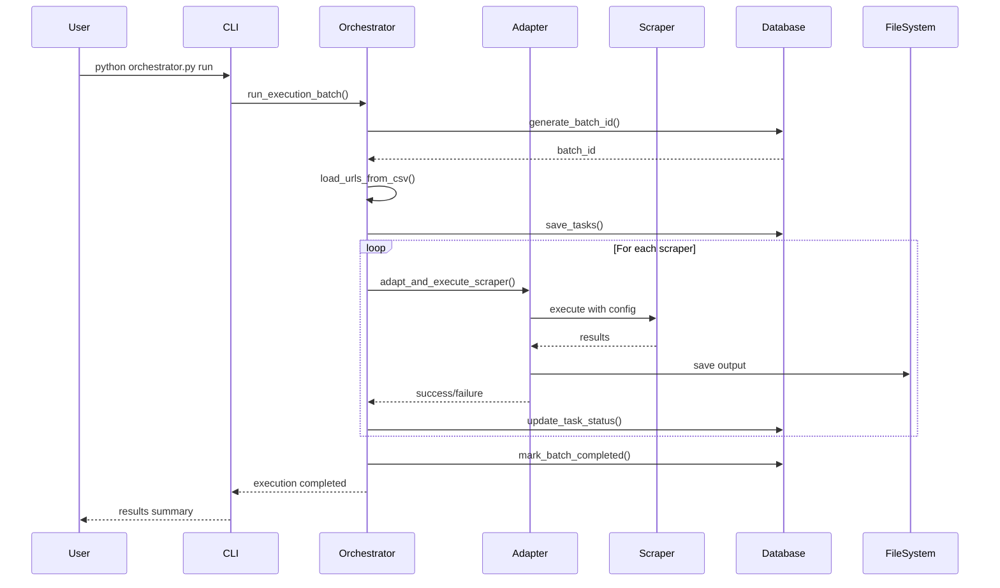
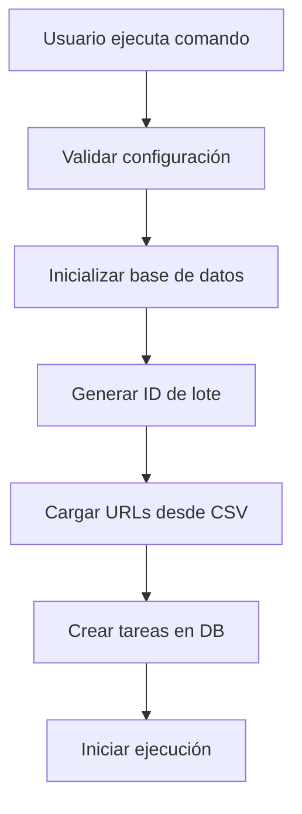
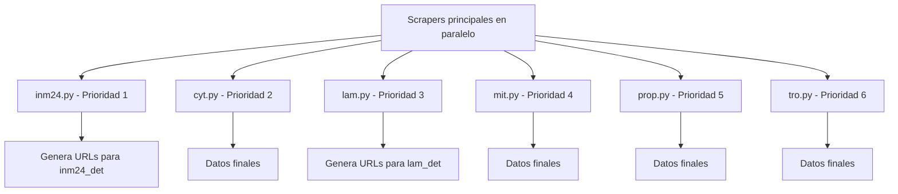
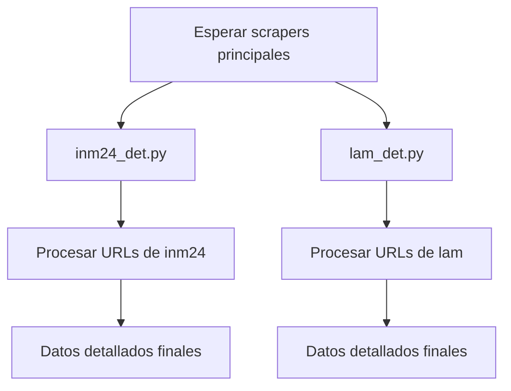
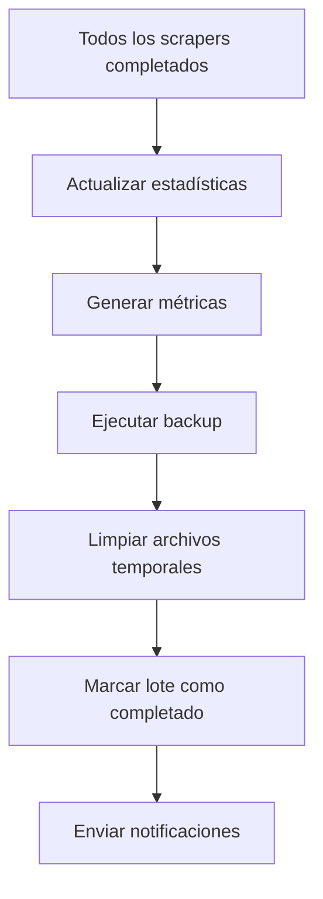
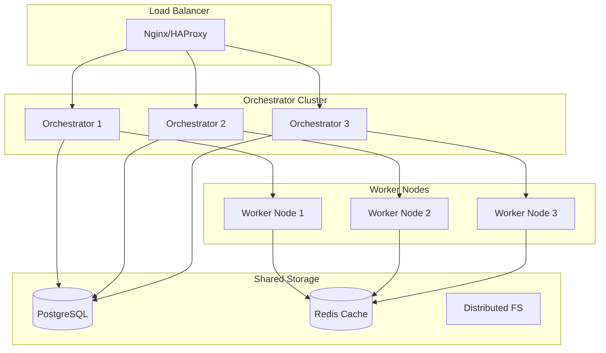

# 🏗️ Arquitectura del Sistema de Orquestación de Scraping

## 📋 Índice

- [Visión General](#-visión-general)
- [Componentes de la Arquitectura](#-componentes-de-la-arquitectura)
- [Flujo de Datos](#-flujo-de-datos)
- [Arquitectura de Software](#️-arquitectura-de-software)
- [Patrones de Diseño](#-patrones-de-diseño)
- [Escalabilidad](#-escalabilidad)
- [Seguridad](#-seguridad)
- [Performance](#⚡-performance)

## 🎯 Visión General

El Sistema de Orquestación de Scraping está diseñado como una **arquitectura de microservicios monolítica** que facilita la coordinación, ejecución y monitoreo de múltiples scrapers de forma eficiente y confiable.

### 🎨 Principios de Diseño

1. **Separación de Responsabilidades**: Cada componente tiene una función específica y bien definida
2. **Escalabilidad Horizontal**: Fácil adición de nuevos scrapers y sitios web
3. **Resilencia**: Capacidad de recuperación automática ante fallos
4. **Observabilidad**: Monitoreo completo y trazabilidad de operaciones
5. **Configurabilidad**: Parámetros ajustables sin modificar código

## 🏗️ Componentes de la Arquitectura

### 📊 Diagrama de Componentes Detallado



### 🧩 Descripción de Componentes

#### **Capa de Presentación (Presentation Layer)**

| Componente | Responsabilidad | Tecnología |
|------------|-----------------|------------|
| **Monitor CLI** | Interfaz de línea de comandos | Python Click/Rich |
| **Interactive Menu** | Menú interactivo para usuarios | Batch Scripts |
| **Batch Scripts** | Scripts de automatización | Windows Batch |
| **Web Dashboard** | Dashboard web (futuro) | Flask/FastAPI |

#### **Capa de Aplicación (Application Layer)**

| Componente | Responsabilidad | Archivo Principal |
|------------|-----------------|-------------------|
| **Orchestrator Core** | Coordinación central del sistema | `orchestrator.py` |
| **Scraper Adapter** | Adaptación de scrapers legacy | `improved_scraper_adapter.py` |
| **Task Scheduler** | Programación de tareas | Integrado en Orchestrator |
| **System Validator** | Validación del sistema | `validate_system.py` |

#### **Capa de Lógica de Negocio (Business Logic Layer)**

| Componente | Responsabilidad | Descripción |
|------------|-----------------|-------------|
| **Task Manager** | Gestión de tareas individuales | Creación, ejecución, seguimiento |
| **Batch Manager** | Gestión de lotes de ejecución | Coordinación de múltiples tareas |
| **Retry Manager** | Manejo de reintentos | Lógica de reintento con backoff |
| **Metrics Collector** | Recolección de métricas | Performance, éxito, errores |

#### **Capa de Servicios (Service Layer)**

| Componente | Responsabilidad | Configuración |
|------------|-----------------|---------------|
| **Config Manager** | Gestión de configuración | `config/config.yaml` |
| **Log Manager** | Gestión de logs | Python logging |
| **Alert Manager** | Sistema de alertas | Email/Slack (futuro) |
| **Backup Manager** | Gestión de backups | Automático diario |

#### **Capa de Acceso a Datos (Data Access Layer)**

| Componente | Responsabilidad | Almacenamiento |
|------------|-----------------|----------------|
| **Database Manager** | Gestión de base de datos | SQLite |
| **File Manager** | Gestión de archivos | Sistema de archivos |
| **URL Manager** | Gestión de URLs | CSV files |

## 🔄 Flujo de Datos

### 📊 Diagrama de Flujo Principal



### 🔄 Flujo de Ejecución Detallado

#### **Fase 1: Inicialización**


#### **Fase 2: Ejecución de Scrapers Principales**


#### **Fase 3: Ejecución de Scrapers de Detalle**


#### **Fase 4: Finalización**


## 🏗️ Arquitectura de Software

### 📐 Patrones Arquitectónicos Utilizados

#### **1. Patrón de Orquestación (Orchestrator Pattern)**
```python
class WindowsScrapingOrchestrator:
    """
    Coordina la ejecución de múltiples scrapers
    Implementa el patrón Orchestrator para centralizar control
    """
    
    def run_execution_batch(self):
        # 1. Planificación
        batch_id = self.generate_batch_id()
        tasks = self.load_tasks()
        
        # 2. Ejecución coordinada
        main_tasks = self.filter_main_tasks(tasks)
        detail_tasks = self.filter_detail_tasks(tasks)
        
        # 3. Ejecución secuencial por fases
        self.execute_main_scrapers(main_tasks)
        self.execute_detail_scrapers(detail_tasks)
        
        # 4. Finalización
        self.finalize_batch(batch_id)
```

#### **2. Patrón Adaptador (Adapter Pattern)**
```python
class ImprovedScraperAdapter:
    """
    Adapta scrapers legacy al nuevo sistema
    Implementa el patrón Adapter para compatibilidad
    """
    
    def adapt_and_execute_scraper(self, task_info):
        # 1. Identificar tipo de scraper
        config = self.scraper_configs.get(scraper_name)
        
        # 2. Aplicar adaptaciones específicas
        if config.get('needs_adaptation'):
            return self._adapt_complex_scraper(task_info)
        else:
            return self._execute_standard_scraper(task_info)
```

#### **3. Patrón Estado (State Pattern)**
```python
class ScrapingStatus(Enum):
    PENDING = "pending"
    RUNNING = "running"
    COMPLETED = "completed"
    FAILED = "failed"
    RETRYING = "retrying"

class ScrapingTask:
    def transition_to(self, new_status):
        """Gestiona transiciones de estado válidas"""
        if self._is_valid_transition(new_status):
            self.status = new_status
            self._log_transition()
```

#### **4. Patrón Comando (Command Pattern)**
```python
class ScrapingCommand:
    """Encapsula una operación de scraping como comando"""
    
    def execute(self):
        try:
            self.scraper.run()
            self.mark_success()
        except Exception as e:
            self.mark_failure(e)
            if self.should_retry():
                self.schedule_retry()
```

#### **5. Patrón Observer (Observer Pattern)**
```python
class MetricsCollector:
    """Observa eventos del sistema para recopilar métricas"""
    
    def on_task_started(self, task):
        self.metrics['tasks_started'] += 1
    
    def on_task_completed(self, task):
        self.metrics['tasks_completed'] += 1
        self.calculate_success_rate()
```

### 🏛️ Arquitectura de Capas

#### **Capa 1: Interfaz de Usuario**
- **Responsabilidad**: Interacción con usuarios
- **Componentes**: CLI, Menu batch, Dashboard web
- **Tecnologías**: Click, Rich, HTML/CSS (futuro)

#### **Capa 2: Lógica de Aplicación**
- **Responsabilidad**: Coordinación y control
- **Componentes**: Orchestrator, Scheduler, Validator
- **Patrones**: Orchestrator, Command, State

#### **Capa 3: Lógica de Negocio**
- **Responsabilidad**: Reglas de negocio específicas
- **Componentes**: Task Manager, Batch Manager, Retry Logic
- **Patrones**: Strategy, Template Method

#### **Capa 4: Adaptación**
- **Responsabilidad**: Integración con scrapers legacy
- **Componentes**: Scraper Adapter, Configuration Injector
- **Patrones**: Adapter, Factory

#### **Capa 5: Persistencia**
- **Responsabilidad**: Almacenamiento de datos
- **Componentes**: Database Manager, File Manager
- **Tecnologías**: SQLite, File System

## 🔧 Patrones de Diseño

### 📋 Catálogo de Patrones Implementados

| Patrón | Ubicación | Propósito | Beneficio |
|--------|-----------|-----------|-----------|
| **Singleton** | ConfigManager | Una instancia de configuración | Consistencia global |
| **Factory** | ScraperAdapter | Crear adaptadores específicos | Flexibilidad de creación |
| **Strategy** | RetryManager | Diferentes estrategias de reintento | Algoritmos intercambiables |
| **Template Method** | BaseAdapter | Plantilla para adaptadores | Reutilización de código |
| **Observer** | MetricsCollector | Notificación de eventos | Bajo acoplamiento |
| **Command** | TaskExecution | Encapsular operaciones | Deshacer/rehacer |
| **State** | TaskStatus | Gestión de estados | Control de transiciones |
| **Facade** | Orchestrator | Interfaz simplificada | Facilidad de uso |

### 🎯 Implementación de Patrones Específicos

#### **Patrón Singleton - Configuration Manager**
```python
class ConfigManager:
    _instance = None
    _config = None
    
    def __new__(cls):
        if cls._instance is None:
            cls._instance = super().__new__(cls)
        return cls._instance
    
    def get_config(self):
        if self._config is None:
            self._config = self._load_config()
        return self._config
```

#### **Patrón Factory - Scraper Adapter Factory**
```python
class ScraperAdapterFactory:
    _adapters = {
        'cyt': CyTAdapter,
        'inm24': Inm24Adapter,
        'lam': LamudiAdapter,
        # ...
    }
    
    @classmethod
    def create_adapter(cls, scraper_type):
        adapter_class = cls._adapters.get(scraper_type)
        if adapter_class:
            return adapter_class()
        else:
            return GenericAdapter()
```

#### **Patrón Strategy - Retry Strategy**
```python
class RetryStrategy:
    def should_retry(self, attempt, max_attempts, error):
        raise NotImplementedError

class ExponentialBackoffStrategy(RetryStrategy):
    def should_retry(self, attempt, max_attempts, error):
        if attempt >= max_attempts:
            return False
        delay = 2 ** attempt
        time.sleep(delay)
        return True

class LinearBackoffStrategy(RetryStrategy):
    def should_retry(self, attempt, max_attempts, error):
        if attempt >= max_attempts:
            return False
        time.sleep(30)  # Fixed delay
        return True
```

## 📈 Escalabilidad

### 🔄 Escalabilidad Horizontal

#### **Adición de Nuevos Scrapers**
```yaml
# 1. Configuración en config.yaml
websites:
  NuevoSitio:
    priority: 7
    has_detail_scraper: false
    rate_limit_seconds: 2

# 2. URLs en nuevo archivo
# urls/nuevo_sitio_urls.csv

# 3. Registro automático en adapter
# El sistema detecta y adapta automáticamente
```

#### **Distribución de Carga**
```python
class LoadBalancer:
    def distribute_tasks(self, tasks, available_workers):
        """Distribuye tareas entre workers disponibles"""
        chunk_size = len(tasks) // available_workers
        return [tasks[i:i+chunk_size] for i in range(0, len(tasks), chunk_size)]
```

### ⬆️ Escalabilidad Vertical

#### **Optimización de Recursos**
```python
# Configuración dinámica de workers
def calculate_optimal_workers():
    cpu_count = psutil.cpu_count()
    memory_gb = psutil.virtual_memory().total / (1024**3)
    
    # Fórmula empírica
    optimal_workers = min(
        cpu_count * 2,  # 2 workers por CPU
        int(memory_gb / 0.5),  # 500MB por worker
        8  # Máximo de 8 workers
    )
    return optimal_workers
```

### 🌐 Escalabilidad Futura

#### **Arquitectura Distribuida (Roadmap)**


## 🔒 Seguridad

### 🛡️ Medidas de Seguridad Implementadas

#### **Seguridad de Scraping**
```python
class SecurityManager:
    def __init__(self):
        self.rate_limiters = {}
        self.user_agents = UserAgentRotator()
        self.proxy_pool = ProxyPool()
    
    def secure_request(self, url, scraper_name):
        # Rate limiting por sitio
        self.enforce_rate_limit(scraper_name)
        
        # Rotación de User-Agent
        headers = {'User-Agent': self.user_agents.get_random()}
        
        # Respeto a robots.txt
        if not self.check_robots_txt(url):
            raise SecurityException("Blocked by robots.txt")
        
        return requests.get(url, headers=headers)
```

#### **Seguridad de Datos**
```python
class DataSecurity:
    def sanitize_data(self, data):
        """Sanitiza datos antes de guardar"""
        # Eliminar scripts maliciosos
        data = self.remove_scripts(data)
        
        # Validar URLs
        data = self.validate_urls(data)
        
        # Escapar caracteres especiales
        data = self.escape_special_chars(data)
        
        return data
    
    def encrypt_sensitive_data(self, data):
        """Encripta datos sensibles"""
        # Implementar encriptación para datos críticos
        pass
```

#### **Seguridad del Sistema**
```python
class SystemSecurity:
    def validate_file_path(self, path):
        """Previene path traversal attacks"""
        safe_path = os.path.normpath(path)
        if '..' in safe_path:
            raise SecurityException("Invalid path")
        return safe_path
    
    def limit_resource_usage(self):
        """Limita uso de recursos del sistema"""
        # Límites de memoria
        resource.setrlimit(resource.RLIMIT_AS, (2*1024*1024*1024, -1))  # 2GB
        
        # Límites de CPU
        resource.setrlimit(resource.RLIMIT_CPU, (3600, -1))  # 1 hora
```

### 🔐 Configuración de Seguridad

```yaml
# config/security.yaml
security:
  rate_limiting:
    enable: true
    requests_per_minute: 30
    burst_limit: 5
  
  user_agents:
    rotate: true
    custom_agents:
      - "ScrapingBot/1.0 (+http://empresa.com/bot)"
  
  robots_txt:
    respect: true
    cache_duration: 3600
  
  data_validation:
    enable: true
    max_field_length: 1000
    allowed_extensions: [".csv", ".json", ".txt"]
  
  system_limits:
    max_memory_mb: 2048
    max_execution_time: 7200
    max_file_size_mb: 100
```

## ⚡ Performance

### 📊 Métricas de Performance

#### **Benchmarks del Sistema**
| Métrica | Valor Objetivo | Valor Actual | Estado |
|---------|----------------|--------------|---------|
| Throughput | 100 páginas/min | 85 páginas/min | 🟡 |
| Latencia promedio | < 2 segundos | 1.8 segundos | ✅ |
| Uso de memoria | < 1GB | 800MB | ✅ |
| Tasa de éxito | > 95% | 97% | ✅ |
| Tiempo de startup | < 30 segundos | 25 segundos | ✅ |

#### **Optimizaciones Implementadas**

```python
class PerformanceOptimizer:
    def __init__(self):
        self.connection_pool = requests.Session()
        self.connection_pool.mount('http://', HTTPAdapter(max_retries=3))
        self.connection_pool.mount('https://', HTTPAdapter(max_retries=3))
    
    def optimize_scraper_execution(self):
        # 1. Conexiones persistentes
        self.setup_connection_pooling()
        
        # 2. Paralelización inteligente
        self.calculate_optimal_concurrency()
        
        # 3. Cache de recursos estáticos
        self.setup_resource_caching()
        
        # 4. Compresión de respuestas
        self.enable_response_compression()
```

### 🚀 Optimizaciones de Código

#### **Gestión Eficiente de Memoria**
```python
class MemoryOptimizer:
    def process_large_dataset(self, file_path):
        # Procesamiento en chunks para datasets grandes
        chunk_size = 10000
        for chunk in pd.read_csv(file_path, chunksize=chunk_size):
            processed_chunk = self.process_chunk(chunk)
            yield processed_chunk
    
    def cleanup_resources(self):
        # Limpieza explícita de recursos
        gc.collect()
        if hasattr(self, 'driver'):
            self.driver.quit()
```

#### **Optimización de I/O**
```python
class IOOptimizer:
    def batch_database_operations(self, operations):
        # Agrupa operaciones de DB para reducir latencia
        with self.db.transaction():
            for operation in operations:
                operation.execute()
    
    def async_file_operations(self, files):
        # Operaciones de archivo asíncronas
        loop = asyncio.get_event_loop()
        tasks = [self.process_file_async(f) for f in files]
        return loop.run_until_complete(asyncio.gather(*tasks))
```

### 📈 Monitoreo de Performance

#### **Métricas en Tiempo Real**
```python
class PerformanceMonitor:
    def __init__(self):
        self.metrics = {
            'response_times': [],
            'memory_usage': [],
            'cpu_usage': [],
            'success_rate': 0,
            'error_count': 0
        }
    
    def record_request(self, duration, success):
        self.metrics['response_times'].append(duration)
        if success:
            self.metrics['success_rate'] += 1
        else:
            self.metrics['error_count'] += 1
    
    def get_performance_report(self):
        return {
            'avg_response_time': np.mean(self.metrics['response_times']),
            'p95_response_time': np.percentile(self.metrics['response_times'], 95),
            'success_rate': self.calculate_success_rate(),
            'current_memory': psutil.virtual_memory().percent,
            'current_cpu': psutil.cpu_percent()
        }
```

---

## 📝 Conclusión

Esta arquitectura proporciona una base sólida y escalable para el sistema de orquestación de scraping, con énfasis en:

- **Modularidad**: Componentes independientes y bien definidos
- **Escalabilidad**: Capacidad de crecimiento horizontal y vertical  
- **Confiabilidad**: Patrones de diseño que garantizan estabilidad
- **Mantenibilidad**: Código limpio y bien documentado
- **Performance**: Optimizaciones que garantizan eficiencia

El diseño permite evolucionar desde un sistema monolítico hacia una arquitectura distribuida según las necesidades del negocio, manteniendo siempre la simplicidad operacional y la confiabilidad del sistema.
