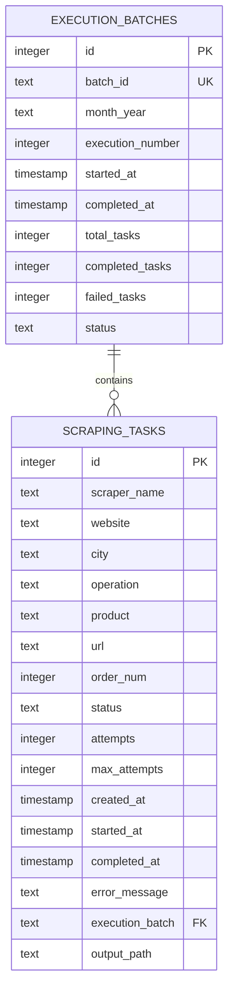
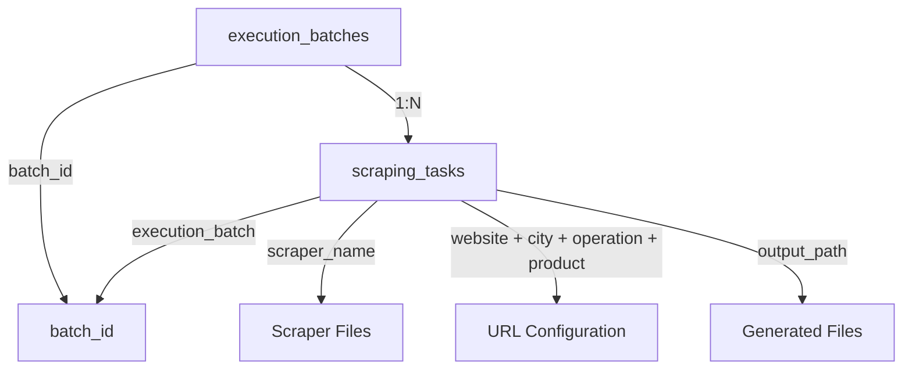

# 🗄️ Database Schema - Sistema de Orquestación de Scraping

## 📋 Índice

- [Visión General](#-visión-general)
- [Esquema de Tablas](#-esquema-de-tablas)
- [Relaciones](#-relaciones)
- [Índices y Optimización](#️-índices-y-optimización)
- [Consultas Comunes](#-consultas-comunes)
- [Migraciones](#-migraciones)
- [Backup y Mantenimiento](#️-backup-y-mantenimiento)
- [Performance](#⚡-performance)

## 🎯 Visión General

El sistema utiliza **SQLite** como base de datos principal debido a sus ventajas para este caso de uso:

- **Simplicidad**: No requiere servidor de base de datos separado
- **Portabilidad**: Base de datos en un solo archivo
- **Rendimiento**: Excelente para aplicaciones de escritura/lectura moderada
- **Transacciones**: Soporte completo para ACID
- **Concurrencia**: Suficiente para el nivel de concurrencia requerido

### 📊 Diseño de la Base de Datos



## 📋 Esquema de Tablas

### 🗂️ Tabla: `execution_batches`

Almacena información sobre lotes de ejecución de scraping.

```sql
CREATE TABLE execution_batches (
    id INTEGER PRIMARY KEY AUTOINCREMENT,
    batch_id TEXT UNIQUE NOT NULL,
    month_year TEXT NOT NULL,
    execution_number INTEGER NOT NULL,
    started_at TIMESTAMP DEFAULT CURRENT_TIMESTAMP,
    completed_at TIMESTAMP,
    total_tasks INTEGER,
    completed_tasks INTEGER DEFAULT 0,
    failed_tasks INTEGER DEFAULT 0,
    status TEXT DEFAULT 'running'
);
```

#### 📝 Descripción de Campos

| Campo | Tipo | Descripción | Ejemplo |
|-------|------|-------------|---------|
| `id` | INTEGER | Clave primaria auto-incremental | `1`, `2`, `3` |
| `batch_id` | TEXT | Identificador único del lote | `Sep25_01`, `Oct25_02` |
| `month_year` | TEXT | Mes y año del lote | `Sep25`, `Oct25` |
| `execution_number` | INTEGER | Número de ejecución en el mes | `1`, `2` |
| `started_at` | TIMESTAMP | Timestamp de inicio | `2025-09-16 10:00:00` |
| `completed_at` | TIMESTAMP | Timestamp de finalización | `2025-09-16 11:30:00` |
| `total_tasks` | INTEGER | Total de tareas en el lote | `28`, `35` |
| `completed_tasks` | INTEGER | Tareas completadas exitosamente | `26`, `33` |
| `failed_tasks` | INTEGER | Tareas que fallaron permanentemente | `2`, `2` |
| `status` | TEXT | Estado del lote | `running`, `completed`, `failed` |

#### 📊 Estados Válidos para `status`

- **`running`**: Lote en ejecución
- **`completed`**: Lote completado (exitoso o con fallos parciales)
- **`failed`**: Lote fallido completamente
- **`cancelled`**: Lote cancelado por el usuario

### 📝 Tabla: `scraping_tasks`

Almacena información detallada sobre tareas individuales de scraping.

```sql
CREATE TABLE scraping_tasks (
    id INTEGER PRIMARY KEY AUTOINCREMENT,
    scraper_name TEXT NOT NULL,
    website TEXT NOT NULL,
    city TEXT NOT NULL,
    operation TEXT NOT NULL,
    product TEXT NOT NULL,
    url TEXT NOT NULL,
    order_num INTEGER NOT NULL,
    status TEXT NOT NULL,
    attempts INTEGER DEFAULT 0,
    max_attempts INTEGER DEFAULT 3,
    created_at TIMESTAMP DEFAULT CURRENT_TIMESTAMP,
    started_at TIMESTAMP,
    completed_at TIMESTAMP,
    error_message TEXT,
    execution_batch TEXT,
    output_path TEXT,
    FOREIGN KEY (execution_batch) REFERENCES execution_batches(batch_id)
);
```

#### 📝 Descripción de Campos

| Campo | Tipo | Descripción | Ejemplo |
|-------|------|-------------|---------|
| `id` | INTEGER | Clave primaria auto-incremental | `1`, `2`, `3` |
| `scraper_name` | TEXT | Nombre del scraper | `cyt`, `inm24`, `lam` |
| `website` | TEXT | Código del sitio web | `CyT`, `Inm24`, `Lam` |
| `city` | TEXT | Código de ciudad | `Gdl`, `Zap`, `Tlaj` |
| `operation` | TEXT | Tipo de operación | `Ven`, `Ren` |
| `product` | TEXT | Tipo de producto | `Dep`, `Cas` |
| `url` | TEXT | URL completa a scrapear | `https://...` |
| `order_num` | INTEGER | Orden de ejecución | `1`, `2`, `3` |
| `status` | TEXT | Estado actual de la tarea | `pending`, `running`, `completed` |
| `attempts` | INTEGER | Número de intentos realizados | `0`, `1`, `2` |
| `max_attempts` | INTEGER | Máximo número de intentos | `3` |
| `created_at` | TIMESTAMP | Timestamp de creación | `2025-09-16 10:00:00` |
| `started_at` | TIMESTAMP | Timestamp de inicio | `2025-09-16 10:05:00` |
| `completed_at` | TIMESTAMP | Timestamp de finalización | `2025-09-16 10:15:00` |
| `error_message` | TEXT | Mensaje de error detallado | `Connection timeout` |
| `execution_batch` | TEXT | ID del lote (FK) | `Sep25_01` |
| `output_path` | TEXT | Ruta del archivo generado | `data/.../file.csv` |

#### 📊 Estados Válidos para `status`

- **`pending`**: Tarea creada, esperando ejecución
- **`running`**: Tarea en ejecución
- **`completed`**: Tarea completada exitosamente
- **`failed`**: Tarea fallida (temporal, puede reintentarse)
- **`retrying`**: Tarea en proceso de reintento
- **`permanently_failed`**: Tarea fallida permanentemente (máximo intentos)

## 🔗 Relaciones

### 📊 Diagrama de Relaciones



### 🔑 Claves y Constraints

```sql
-- Constraint para asegurar batch_id único
ALTER TABLE execution_batches ADD CONSTRAINT uk_batch_id UNIQUE (batch_id);

-- Constraint para asegurar combinación única por lote
ALTER TABLE scraping_tasks ADD CONSTRAINT uk_task_per_batch 
    UNIQUE (execution_batch, scraper_name, website, city, operation, product);

-- Constraint para estados válidos
ALTER TABLE execution_batches ADD CONSTRAINT ck_batch_status 
    CHECK (status IN ('running', 'completed', 'failed', 'cancelled'));

ALTER TABLE scraping_tasks ADD CONSTRAINT ck_task_status 
    CHECK (status IN ('pending', 'running', 'completed', 'failed', 'retrying', 'permanently_failed'));

-- Constraint para intentos válidos
ALTER TABLE scraping_tasks ADD CONSTRAINT ck_attempts 
    CHECK (attempts >= 0 AND attempts <= max_attempts);
```

## ⚡ Índices y Optimización

### 📊 Índices Principales

```sql
-- Índices para optimización de consultas frecuentes

-- Índice para consultas por estado de tareas
CREATE INDEX idx_tasks_status ON scraping_tasks(status);

-- Índice para consultas por lote
CREATE INDEX idx_tasks_batch ON scraping_tasks(execution_batch);

-- Índice para consultas por fecha de creación
CREATE INDEX idx_tasks_created ON scraping_tasks(created_at);

-- Índice para consultas por scraper
CREATE INDEX idx_tasks_scraper ON scraping_tasks(scraper_name);

-- Índice para consultas por sitio web
CREATE INDEX idx_tasks_website ON scraping_tasks(website);

-- Índice compuesto para consultas de progreso por lote
CREATE INDEX idx_batch_progress ON scraping_tasks(execution_batch, status);

-- Índice para consultas temporales en lotes
CREATE INDEX idx_batches_date ON execution_batches(started_at);

-- Índice para consultas por estado de lote
CREATE INDEX idx_batches_status ON execution_batches(status);
```

### 🎯 Optimización de Consultas

#### **Consultas Optimizadas Comunes**

```sql
-- 1. Estado actual del sistema (usa idx_batches_date)
SELECT * FROM execution_batches 
ORDER BY started_at DESC 
LIMIT 1;

-- 2. Progreso de lote específico (usa idx_batch_progress)
SELECT status, COUNT(*) as count
FROM scraping_tasks 
WHERE execution_batch = 'Sep25_01'
GROUP BY status;

-- 3. Tareas fallidas recientes (usa idx_tasks_created, idx_tasks_status)
SELECT scraper_name, website, error_message
FROM scraping_tasks 
WHERE status = 'failed' 
  AND created_at >= datetime('now', '-7 days')
ORDER BY created_at DESC;

-- 4. Estadísticas por scraper (usa idx_tasks_scraper)
SELECT scraper_name, 
       COUNT(*) as total,
       SUM(CASE WHEN status = 'completed' THEN 1 ELSE 0 END) as completed,
       SUM(CASE WHEN status = 'failed' THEN 1 ELSE 0 END) as failed
FROM scraping_tasks 
WHERE created_at >= datetime('now', '-30 days')
GROUP BY scraper_name;
```

## 📊 Consultas Comunes

### 🎯 Consultas de Monitoreo

#### **1. Estado del Sistema**

```sql
-- Estado del último lote
SELECT 
    batch_id,
    status,
    started_at,
    completed_at,
    total_tasks,
    completed_tasks,
    failed_tasks,
    ROUND(
        CASE 
            WHEN total_tasks > 0 THEN (completed_tasks * 100.0 / total_tasks)
            ELSE 0 
        END, 2
    ) as progress_percentage
FROM execution_batches 
ORDER BY started_at DESC 
LIMIT 1;
```

#### **2. Progreso en Tiempo Real**

```sql
-- Progreso detallado del lote actual
SELECT 
    eb.batch_id,
    eb.started_at,
    eb.total_tasks,
    COUNT(st.id) as current_tasks,
    SUM(CASE WHEN st.status = 'completed' THEN 1 ELSE 0 END) as completed,
    SUM(CASE WHEN st.status = 'running' THEN 1 ELSE 0 END) as running,
    SUM(CASE WHEN st.status = 'pending' THEN 1 ELSE 0 END) as pending,
    SUM(CASE WHEN st.status = 'failed' THEN 1 ELSE 0 END) as failed
FROM execution_batches eb
LEFT JOIN scraping_tasks st ON eb.batch_id = st.execution_batch
WHERE eb.status = 'running'
GROUP BY eb.batch_id, eb.started_at, eb.total_tasks;
```

#### **3. Tareas Activas**

```sql
-- Tareas actualmente en ejecución
SELECT 
    scraper_name,
    website,
    city,
    operation,
    product,
    started_at,
    ROUND(
        (julianday('now') - julianday(started_at)) * 24 * 60, 2
    ) as duration_minutes
FROM scraping_tasks 
WHERE status = 'running'
ORDER BY started_at;
```

### 📈 Consultas de Análisis

#### **1. Rendimiento por Scraper**

```sql
-- Análisis de rendimiento por scraper (últimos 30 días)
SELECT 
    scraper_name,
    COUNT(*) as total_executions,
    SUM(CASE WHEN status = 'completed' THEN 1 ELSE 0 END) as successful,
    SUM(CASE WHEN status = 'failed' THEN 1 ELSE 0 END) as failed,
    ROUND(
        SUM(CASE WHEN status = 'completed' THEN 1 ELSE 0 END) * 100.0 / COUNT(*), 2
    ) as success_rate,
    AVG(attempts) as avg_attempts,
    AVG(
        CASE 
            WHEN completed_at IS NOT NULL AND started_at IS NOT NULL 
            THEN (julianday(completed_at) - julianday(started_at)) * 24 * 60
            ELSE NULL 
        END
    ) as avg_duration_minutes
FROM scraping_tasks 
WHERE created_at >= datetime('now', '-30 days')
GROUP BY scraper_name
ORDER BY success_rate DESC;
```

#### **2. Tendencias Temporales**

```sql
-- Tendencias por día (últimos 7 días)
SELECT 
    DATE(created_at) as date,
    COUNT(*) as total_tasks,
    SUM(CASE WHEN status = 'completed' THEN 1 ELSE 0 END) as completed_tasks,
    ROUND(
        SUM(CASE WHEN status = 'completed' THEN 1 ELSE 0 END) * 100.0 / COUNT(*), 2
    ) as daily_success_rate
FROM scraping_tasks 
WHERE created_at >= datetime('now', '-7 days')
GROUP BY DATE(created_at)
ORDER BY date;
```

#### **3. Análisis de Errores**

```sql
-- Top errores más frecuentes
SELECT 
    error_message,
    COUNT(*) as frequency,
    GROUP_CONCAT(DISTINCT scraper_name) as affected_scrapers,
    MAX(created_at) as last_occurrence
FROM scraping_tasks 
WHERE status = 'failed' 
  AND error_message IS NOT NULL
  AND created_at >= datetime('now', '-7 days')
GROUP BY error_message
ORDER BY frequency DESC
LIMIT 10;
```

### 🔍 Consultas de Diagnóstico

#### **1. Tareas Problemáticas**

```sql
-- Tareas con múltiples fallos
SELECT 
    scraper_name,
    website,
    city,
    url,
    attempts,
    error_message,
    created_at
FROM scraping_tasks 
WHERE attempts >= 2 
  AND status IN ('failed', 'retrying')
ORDER BY attempts DESC, created_at DESC;
```

#### **2. Lotes Incompletos**

```sql
-- Lotes que no completaron todas las tareas
SELECT 
    eb.batch_id,
    eb.started_at,
    eb.total_tasks,
    eb.completed_tasks,
    eb.failed_tasks,
    (eb.total_tasks - eb.completed_tasks - eb.failed_tasks) as pending_tasks
FROM execution_batches eb
WHERE eb.total_tasks > (eb.completed_tasks + eb.failed_tasks)
  AND eb.started_at >= datetime('now', '-7 days')
ORDER BY eb.started_at DESC;
```

## 🔄 Migraciones

### 📋 Sistema de Versionado

```sql
-- Tabla para tracking de versiones de schema
CREATE TABLE IF NOT EXISTS schema_migrations (
    version INTEGER PRIMARY KEY,
    description TEXT NOT NULL,
    applied_at TIMESTAMP DEFAULT CURRENT_TIMESTAMP
);
```

### 📊 Migraciones Disponibles

#### **Migración 001: Schema Inicial**

```sql
-- Versión: 001
-- Descripción: Creación del schema inicial

-- Verificar si ya existe
INSERT OR IGNORE INTO schema_migrations (version, description) 
VALUES (1, 'Initial schema creation');

-- Crear tablas principales
CREATE TABLE IF NOT EXISTS execution_batches (
    id INTEGER PRIMARY KEY AUTOINCREMENT,
    batch_id TEXT UNIQUE NOT NULL,
    month_year TEXT NOT NULL,
    execution_number INTEGER NOT NULL,
    started_at TIMESTAMP DEFAULT CURRENT_TIMESTAMP,
    completed_at TIMESTAMP,
    total_tasks INTEGER,
    completed_tasks INTEGER DEFAULT 0,
    failed_tasks INTEGER DEFAULT 0,
    status TEXT DEFAULT 'running'
);

CREATE TABLE IF NOT EXISTS scraping_tasks (
    id INTEGER PRIMARY KEY AUTOINCREMENT,
    scraper_name TEXT NOT NULL,
    website TEXT NOT NULL,
    city TEXT NOT NULL,
    operation TEXT NOT NULL,
    product TEXT NOT NULL,
    url TEXT NOT NULL,
    order_num INTEGER NOT NULL,
    status TEXT NOT NULL,
    attempts INTEGER DEFAULT 0,
    max_attempts INTEGER DEFAULT 3,
    created_at TIMESTAMP DEFAULT CURRENT_TIMESTAMP,
    started_at TIMESTAMP,
    completed_at TIMESTAMP,
    error_message TEXT,
    execution_batch TEXT,
    output_path TEXT
);
```

#### **Migración 002: Índices de Performance**

```sql
-- Versión: 002  
-- Descripción: Agregar índices para optimización

INSERT OR IGNORE INTO schema_migrations (version, description) 
VALUES (2, 'Performance indexes');

CREATE INDEX IF NOT EXISTS idx_tasks_status ON scraping_tasks(status);
CREATE INDEX IF NOT EXISTS idx_tasks_batch ON scraping_tasks(execution_batch);
CREATE INDEX IF NOT EXISTS idx_tasks_created ON scraping_tasks(created_at);
CREATE INDEX IF NOT EXISTS idx_batches_date ON execution_batches(started_at);
```

#### **Migración 003: Campos Adicionales**

```sql
-- Versión: 003
-- Descripción: Agregar campos de métricas adicionales

INSERT OR IGNORE INTO schema_migrations (version, description) 
VALUES (3, 'Additional metrics fields');

-- Agregar campos si no existen
ALTER TABLE execution_batches ADD COLUMN estimated_duration_minutes INTEGER;
ALTER TABLE execution_batches ADD COLUMN actual_duration_minutes INTEGER;
ALTER TABLE scraping_tasks ADD COLUMN data_records_extracted INTEGER DEFAULT 0;
ALTER TABLE scraping_tasks ADD COLUMN file_size_bytes INTEGER DEFAULT 0;
```

### 🔧 Script de Migración

```python
#!/usr/bin/env python3
"""
Script de migración de base de datos
"""

import sqlite3
from pathlib import Path

def get_current_version(conn):
    """Obtiene la versión actual del schema"""
    try:
        cursor = conn.execute("SELECT MAX(version) FROM schema_migrations")
        result = cursor.fetchone()
        return result[0] if result[0] else 0
    except sqlite3.OperationalError:
        # Tabla no existe, es primera migración
        return 0

def apply_migration(conn, version, sql_script):
    """Aplica una migración específica"""
    try:
        conn.executescript(sql_script)
        conn.commit()
        print(f"✅ Migración {version} aplicada exitosamente")
        return True
    except Exception as e:
        print(f"❌ Error aplicando migración {version}: {e}")
        conn.rollback()
        return False

def run_migrations(db_path):
    """Ejecuta todas las migraciones pendientes"""
    conn = sqlite3.connect(db_path)
    
    # Crear tabla de migraciones si no existe
    conn.execute("""
        CREATE TABLE IF NOT EXISTS schema_migrations (
            version INTEGER PRIMARY KEY,
            description TEXT NOT NULL,
            applied_at TIMESTAMP DEFAULT CURRENT_TIMESTAMP
        )
    """)
    
    current_version = get_current_version(conn)
    print(f"Versión actual del schema: {current_version}")
    
    # Definir migraciones disponibles
    migrations = {
        1: {
            'description': 'Initial schema creation',
            'script': Path('migrations/001_initial_schema.sql').read_text()
        },
        2: {
            'description': 'Performance indexes',
            'script': Path('migrations/002_performance_indexes.sql').read_text()
        },
        3: {
            'description': 'Additional metrics fields',
            'script': Path('migrations/003_additional_fields.sql').read_text()
        }
    }
    
    # Aplicar migraciones pendientes
    for version, migration in migrations.items():
        if version > current_version:
            print(f"Aplicando migración {version}: {migration['description']}")
            if apply_migration(conn, version, migration['script']):
                current_version = version
            else:
                break
    
    conn.close()
    print(f"Migraciones completadas. Versión final: {current_version}")

if __name__ == "__main__":
    run_migrations("orchestrator.db")
```

## 🛠️ Backup y Mantenimiento

### 💾 Estrategia de Backup

```python
#!/usr/bin/env python3
"""
Sistema de backup automático para la base de datos
"""

import sqlite3
import shutil
import datetime
from pathlib import Path
import gzip

class DatabaseBackup:
    def __init__(self, db_path, backup_dir):
        self.db_path = Path(db_path)
        self.backup_dir = Path(backup_dir)
        self.backup_dir.mkdir(exist_ok=True)
    
    def create_backup(self):
        """Crea un backup de la base de datos"""
        timestamp = datetime.datetime.now().strftime("%Y%m%d_%H%M%S")
        backup_name = f"orchestrator_backup_{timestamp}.db"
        backup_path = self.backup_dir / backup_name
        
        # Backup usando SQLite backup API
        source = sqlite3.connect(self.db_path)
        backup = sqlite3.connect(backup_path)
        
        source.backup(backup)
        source.close()
        backup.close()
        
        # Comprimir backup
        compressed_path = backup_path.with_suffix('.db.gz')
        with open(backup_path, 'rb') as f_in:
            with gzip.open(compressed_path, 'wb') as f_out:
                shutil.copyfileobj(f_in, f_out)
        
        # Eliminar archivo sin comprimir
        backup_path.unlink()
        
        print(f"Backup creado: {compressed_path}")
        return compressed_path
    
    def cleanup_old_backups(self, retain_days=30):
        """Elimina backups antiguos"""
        cutoff_date = datetime.datetime.now() - datetime.timedelta(days=retain_days)
        
        for backup_file in self.backup_dir.glob("orchestrator_backup_*.db.gz"):
            if backup_file.stat().st_mtime < cutoff_date.timestamp():
                backup_file.unlink()
                print(f"Backup antiguo eliminado: {backup_file}")
```

### 🧹 Mantenimiento de Base de Datos

```sql
-- Script de mantenimiento regular

-- 1. Vacuum para optimizar espacio
VACUUM;

-- 2. Reindexar para optimizar consultas
REINDEX;

-- 3. Analizar estadísticas para optimizador
ANALYZE;

-- 4. Verificar integridad
PRAGMA integrity_check;

-- 5. Estadísticas de la base de datos
PRAGMA database_list;
PRAGMA table_info(scraping_tasks);
PRAGMA table_info(execution_batches);

-- 6. Información de tamaño
SELECT 
    name,
    COUNT(*) as row_count
FROM sqlite_master 
WHERE type = 'table' 
  AND name IN ('scraping_tasks', 'execution_batches');
```

### 🔧 Script de Mantenimiento Automático

```python
#!/usr/bin/env python3
"""
Script de mantenimiento automático de la base de datos
"""

import sqlite3
import time
from pathlib import Path

def maintain_database(db_path):
    """Ejecuta mantenimiento de la base de datos"""
    conn = sqlite3.connect(db_path)
    
    print("Iniciando mantenimiento de base de datos...")
    
    # 1. Limpiar tareas muy antiguas (más de 6 meses)
    print("Limpiando tareas antiguas...")
    cursor = conn.execute("""
        DELETE FROM scraping_tasks 
        WHERE created_at < datetime('now', '-6 months')
    """)
    deleted_tasks = cursor.rowcount
    print(f"Tareas antiguas eliminadas: {deleted_tasks}")
    
    # 2. Limpiar lotes completados antiguos (más de 3 meses)
    print("Limpiando lotes antiguos...")
    cursor = conn.execute("""
        DELETE FROM execution_batches 
        WHERE completed_at < datetime('now', '-3 months')
          AND status = 'completed'
    """)
    deleted_batches = cursor.rowcount
    print(f"Lotes antiguos eliminados: {deleted_batches}")
    
    # 3. Vacuum y optimización
    print("Optimizando base de datos...")
    conn.execute("VACUUM")
    conn.execute("REINDEX")
    conn.execute("ANALYZE")
    
    # 4. Verificar integridad
    print("Verificando integridad...")
    cursor = conn.execute("PRAGMA integrity_check")
    integrity_result = cursor.fetchone()
    
    if integrity_result[0] == "ok":
        print("✅ Integridad de base de datos: OK")
    else:
        print(f"❌ Problema de integridad: {integrity_result[0]}")
    
    # 5. Estadísticas finales
    cursor = conn.execute("SELECT COUNT(*) FROM scraping_tasks")
    total_tasks = cursor.fetchone()[0]
    
    cursor = conn.execute("SELECT COUNT(*) FROM execution_batches")
    total_batches = cursor.fetchone()[0]
    
    print(f"Mantenimiento completado:")
    print(f"  Total tareas: {total_tasks}")
    print(f"  Total lotes: {total_batches}")
    
    conn.close()

if __name__ == "__main__":
    maintain_database("orchestrator.db")
```

## ⚡ Performance

### 📊 Métricas de Performance

```sql
-- Consulta para métricas de performance de la DB
SELECT 
    'Database Size' as metric,
    ROUND(page_count * page_size / 1024.0 / 1024.0, 2) || ' MB' as value
FROM pragma_page_count(), pragma_page_size()

UNION ALL

SELECT 
    'Total Tables' as metric,
    COUNT(*) as value
FROM sqlite_master 
WHERE type = 'table'

UNION ALL

SELECT 
    'Total Indexes' as metric,
    COUNT(*) as value
FROM sqlite_master 
WHERE type = 'index';
```

### 🎯 Optimización de Consultas

#### **Query Analyzer**

```sql
-- Analizar plan de ejecución para consultas críticas
EXPLAIN QUERY PLAN 
SELECT * FROM scraping_tasks 
WHERE execution_batch = 'Sep25_01' 
  AND status = 'completed'
ORDER BY completed_at;

-- Verificar uso de índices
EXPLAIN QUERY PLAN
SELECT scraper_name, COUNT(*) 
FROM scraping_tasks 
WHERE created_at >= datetime('now', '-7 days')
GROUP BY scraper_name;
```

#### **Configuración de Performance**

```sql
-- Configuraciones para optimizar performance
PRAGMA cache_size = 10000;      -- Aumentar cache
PRAGMA temp_store = MEMORY;     -- Usar memoria para temporales
PRAGMA journal_mode = WAL;      -- WAL mode para mejor concurrencia
PRAGMA synchronous = NORMAL;    -- Balance entre seguridad y velocidad
PRAGMA mmap_size = 268435456;   -- 256MB mmap
```

---

## 📝 Conclusión

Este esquema de base de datos está diseñado para:

### ✅ **Características Principales**

- **Simplicidad**: Estructura clara y fácil de entender
- **Performance**: Índices optimizados para consultas frecuentes
- **Escalabilidad**: Diseño que soporta crecimiento de datos
- **Mantenibilidad**: Sistema de migraciones y mantenimiento automático
- **Confiabilidad**: Backups automáticos y verificación de integridad

### 🔄 **Beneficios del Diseño**

- **Consultas rápidas**: Índices específicos para casos de uso comunes
- **Integridad de datos**: Constraints que garantizan consistencia
- **Análisis detallado**: Estructura que facilita reporting y análisis
- **Recuperación**: Sistema robusto de backup y restauración

Este esquema proporciona una base sólida para el sistema de orquestación, balanceando simplicidad operacional con capacidades analíticas avanzadas.
