# 🔄 Flujo del Sistema de Orquestación de Scraping

## 📋 Índice

- [Descripción General del Flujo](#-descripción-general-del-flujo)
- [Flujo de Ejecución Principal](#-flujo-de-ejecución-principal)
- [Flujos de Scrapers Específicos](#-flujos-de-scrapers-específicos)
- [Gestión de Estados](#-gestión-de-estados)
- [Flujo de Manejo de Errores](#-flujo-de-manejo-de-errores)
- [Flujo de Datos](#-flujo-de-datos)
- [Flujo de Configuración](#️-flujo-de-configuración)
- [Flujo de Monitoreo](#-flujo-de-monitoreo)

## 🎯 Descripción General del Flujo

El sistema opera mediante un **flujo de orquestación coordinada** que ejecuta múltiples scrapers de forma inteligente, respetando dependencias, prioridades y límites de recursos.

### 🏗️ Principios del Flujo

1. **Ejecución por Fases**: Scrapers principales → Scrapers de detalle
2. **Dependencias Automáticas**: Los scrapers de detalle esperan a los principales
3. **Paralelización Inteligente**: Múltiples scrapers ejecutan simultáneamente cuando es posible
4. **Recuperación Automática**: Reintentos y recuperación ante fallos
5. **Trazabilidad Completa**: Cada paso es registrado y auditable

## 🚀 Flujo de Ejecución Principal

### 📊 Diagrama de Flujo Completo

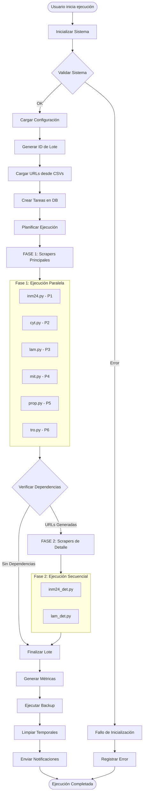

### ⏱️ Timeline de Ejecución

```mermaid
gantt
    title Cronograma de Ejecución de Scraping
    dateFormat X
    axisFormat %H:%M
    
    section Inicialización
    Validar Sistema     :init, 0, 2
    Cargar Config       :config, after init, 1
    Generar Lote        :batch, after config, 1
    Crear Tareas        :tasks, after batch, 2
    
    section Fase 1: Principales
    inm24.py (P1)       :inm24, after tasks, 8
    cyt.py (P2)         :cyt, after tasks, 6
    lam.py (P3)         :lam, after tasks, 7
    mit.py (P4)         :mit, after tasks, 5
    prop.py (P5)        :prop, after tasks, 4
    tro.py (P6)         :tro, after tasks, 3
    
    section Fase 2: Detalle
    inm24_det.py        :inm24det, after inm24, 5
    lam_det.py          :lamdet, after lam, 4
    
    section Finalización
    Generar Métricas    :metrics, after inm24det, 1
    Backup              :backup, after metrics, 2
    Notificaciones      :notify, after backup, 1
```

### 🔄 Estados del Flujo

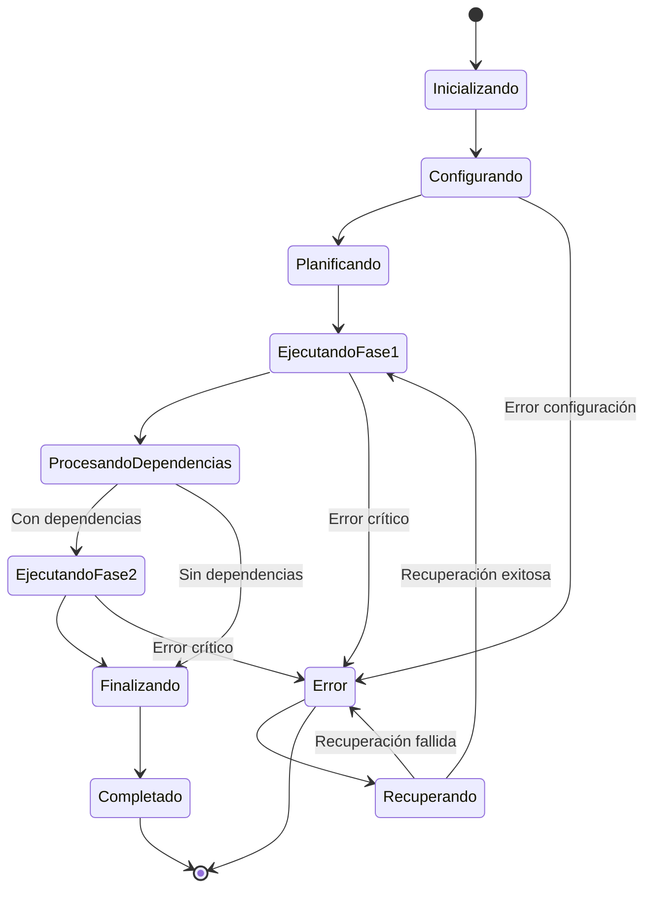

## 🔧 Flujos de Scrapers Específicos

### 📊 Flujo de Scraper Principal (Ejemplo: CyT)

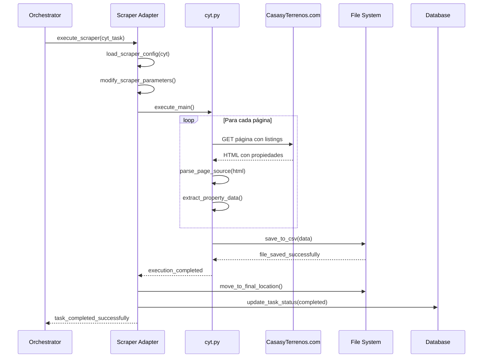

### 🔗 Flujo de Scraper de Detalle (Ejemplo: Inm24_det)

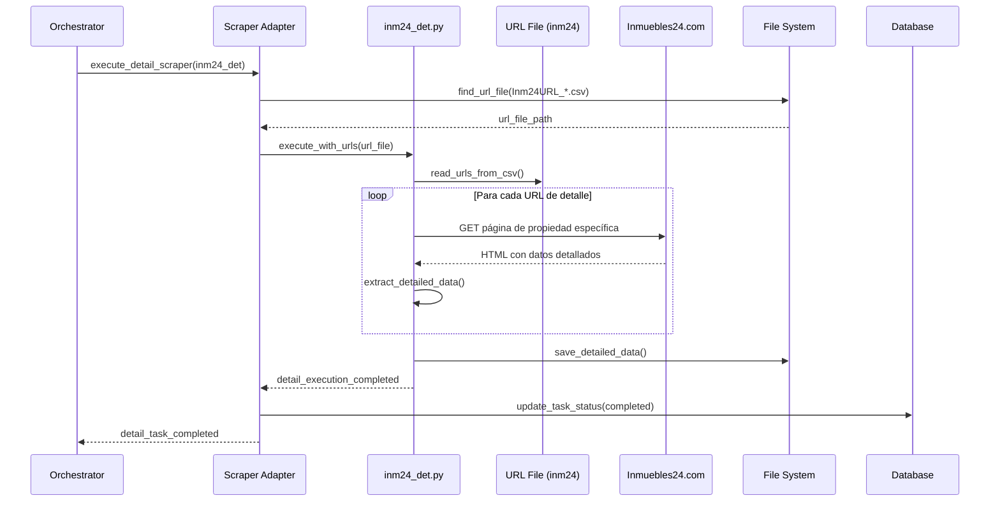

### ⚙️ Flujo de Configuración Dinámica

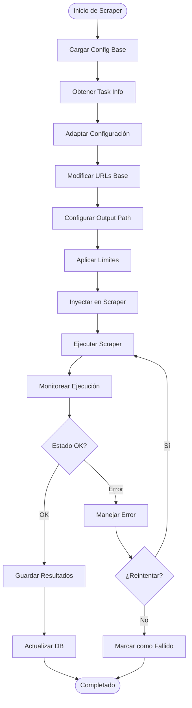

## 🎛️ Gestión de Estados

### 📊 Diagrama de Estados de Tareas

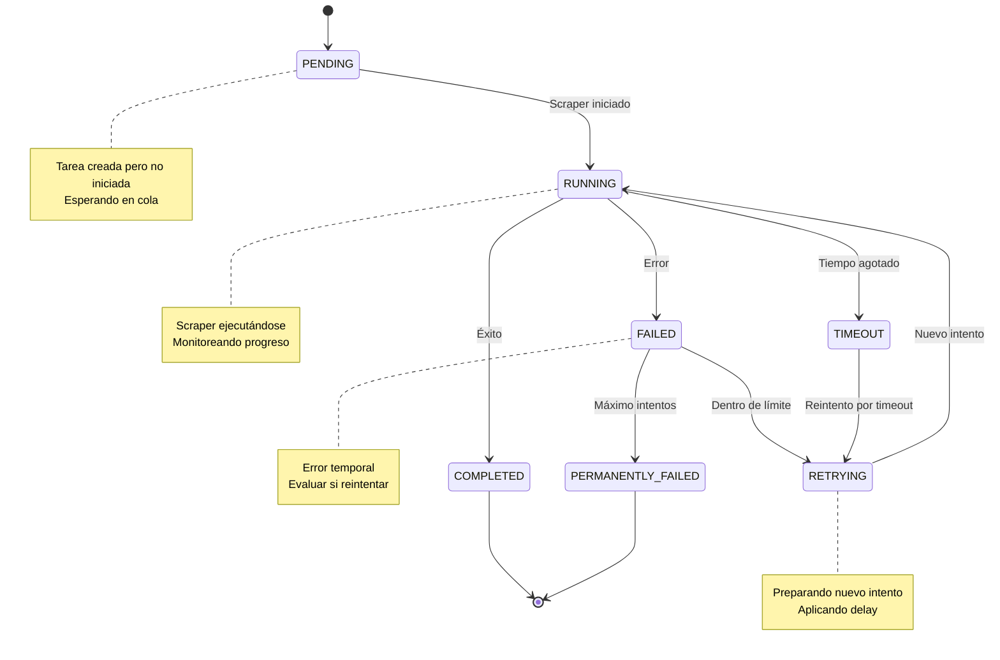

### 🔄 Transiciones de Estado Permitidas

| Estado Actual | Estado Destino | Condición | Acción |
|---------------|----------------|-----------|---------|
| PENDING | RUNNING | Scraper disponible | Iniciar ejecución |
| RUNNING | COMPLETED | Éxito | Guardar resultados |
| RUNNING | FAILED | Error recuperable | Evaluar reintentos |
| RUNNING | TIMEOUT | Tiempo límite | Terminar proceso |
| FAILED | RETRYING | attempts < max_attempts | Programar reintento |
| FAILED | PERMANENTLY_FAILED | attempts >= max_attempts | Marcar como fallido |
| TIMEOUT | RETRYING | Timeout recuperable | Programar reintento |
| RETRYING | RUNNING | Delay completado | Reiniciar ejecución |

### 🎯 Gestión de Estados por Lote

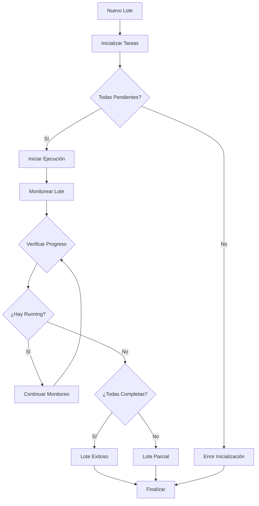

## ⚠️ Flujo de Manejo de Errores

### 🚨 Clasificación de Errores

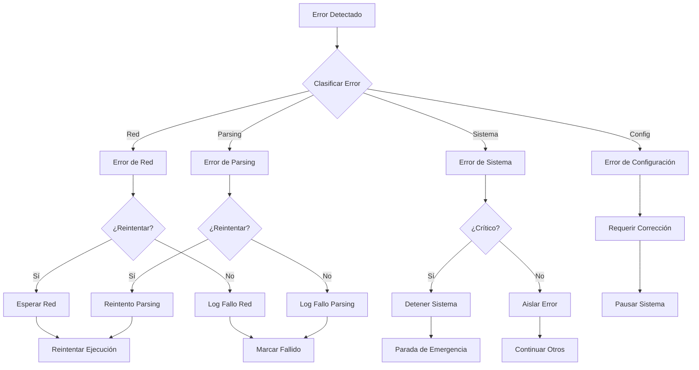

### 🔄 Estrategias de Reintento

```python
class RetryStrategy:
    """Estrategias de reintento configurables"""
    
    def exponential_backoff(self, attempt, base_delay=30):
        """Backoff exponencial: 30s, 60s, 120s, 240s..."""
        return base_delay * (2 ** attempt)
    
    def linear_backoff(self, attempt, base_delay=30):
        """Backoff lineal: 30s, 60s, 90s, 120s..."""
        return base_delay * (attempt + 1)
    
    def fixed_delay(self, attempt, delay=30):
        """Delay fijo: 30s entre cada intento"""
        return delay
    
    def immediate_retry(self, attempt):
        """Reintento inmediato (para errores menores)"""
        return 0
```

### 📊 Flujo de Recuperación Automática

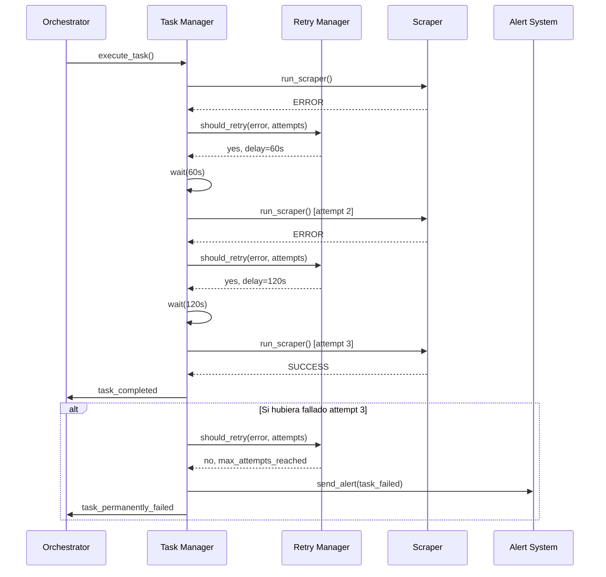

## 📊 Flujo de Datos

### 🗂️ Estructura de Datos en el Flujo

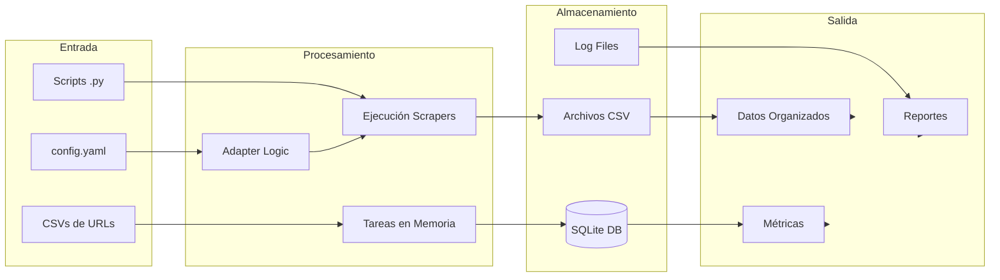

### 📋 Formato de Datos Intermedios

#### **TaskInfo Structure**
```json
{
  "task_id": "uuid-string",
  "scraper_name": "cyt",
  "website": "CyT",
  "city": "Gdl",
  "operation": "Ven",
  "product": "Dep",
  "url": "https://example.com",
  "order": 1,
  "status": "pending",
  "attempts": 0,
  "max_attempts": 3,
  "created_at": "2025-09-16T10:00:00",
  "started_at": null,
  "completed_at": null,
  "error_message": null,
  "execution_batch": "Sep25_01",
  "output_path": "data/CyT/Gdl/Ven/Dep/Sep25/01/CyT_Gdl_Ven_Dep_Sep25_01.csv"
}
```

#### **BatchInfo Structure**
```json
{
  "batch_id": "Sep25_01",
  "month_year": "Sep25",
  "execution_number": 1,
  "started_at": "2025-09-16T10:00:00",
  "completed_at": null,
  "total_tasks": 28,
  "completed_tasks": 0,
  "failed_tasks": 0,
  "status": "running",
  "estimated_completion": "2025-09-16T11:30:00"
}
```

### 🔄 Transformaciones de Datos

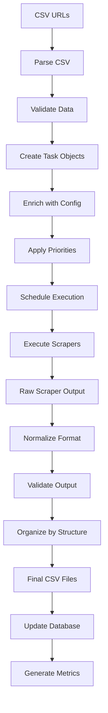

## ⚙️ Flujo de Configuración

### 🔧 Carga de Configuración

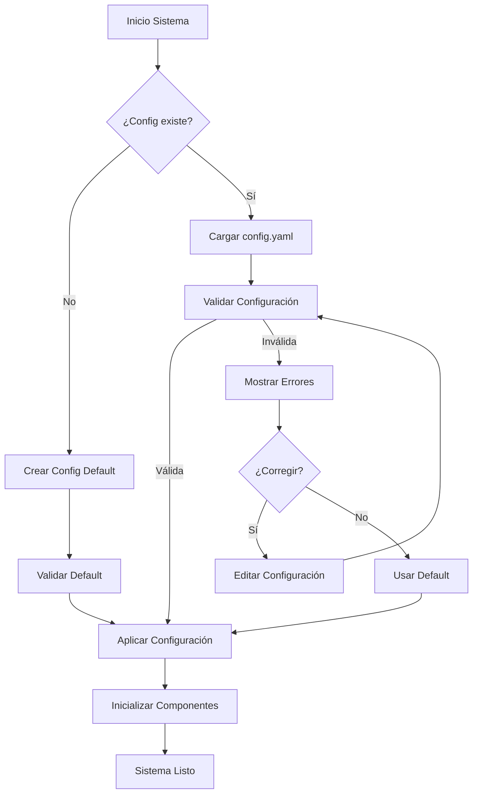

### 🎯 Configuración por Scraper

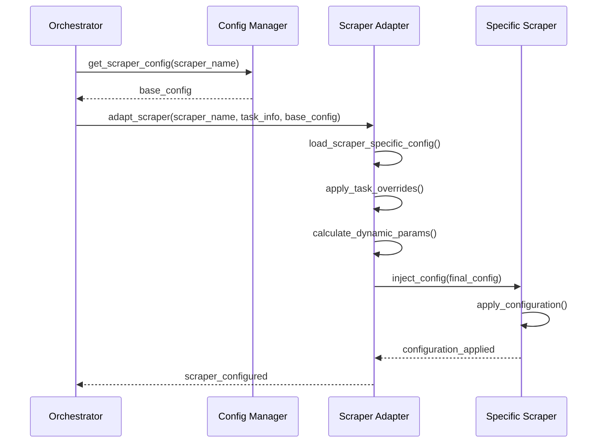

## 📊 Flujo de Monitoreo

### 📈 Recolección de Métricas

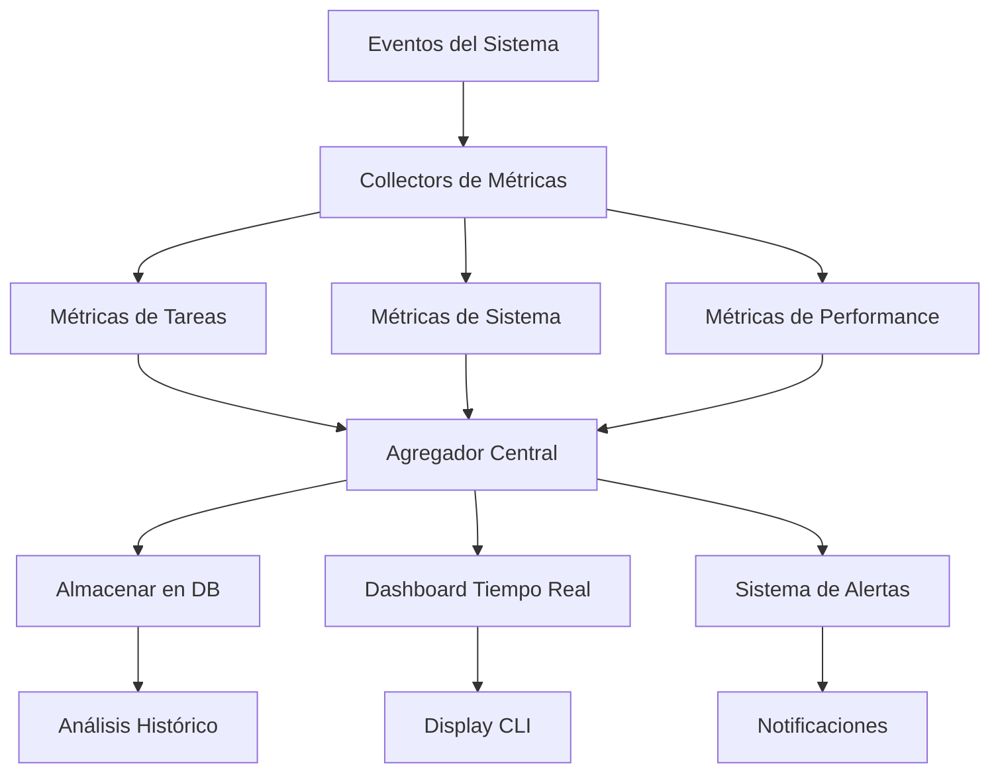

### 🎛️ Dashboard en Tiempo Real

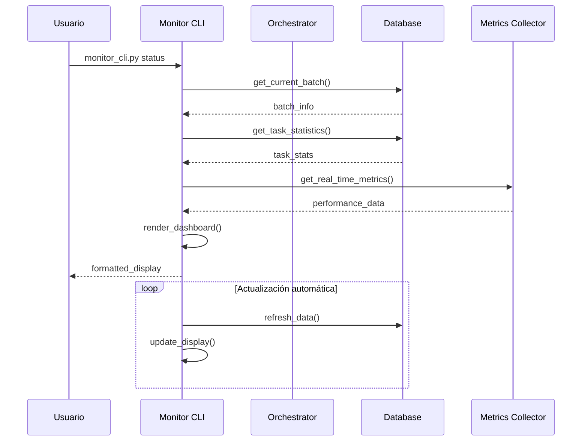

### 📊 Flujo de Alertas

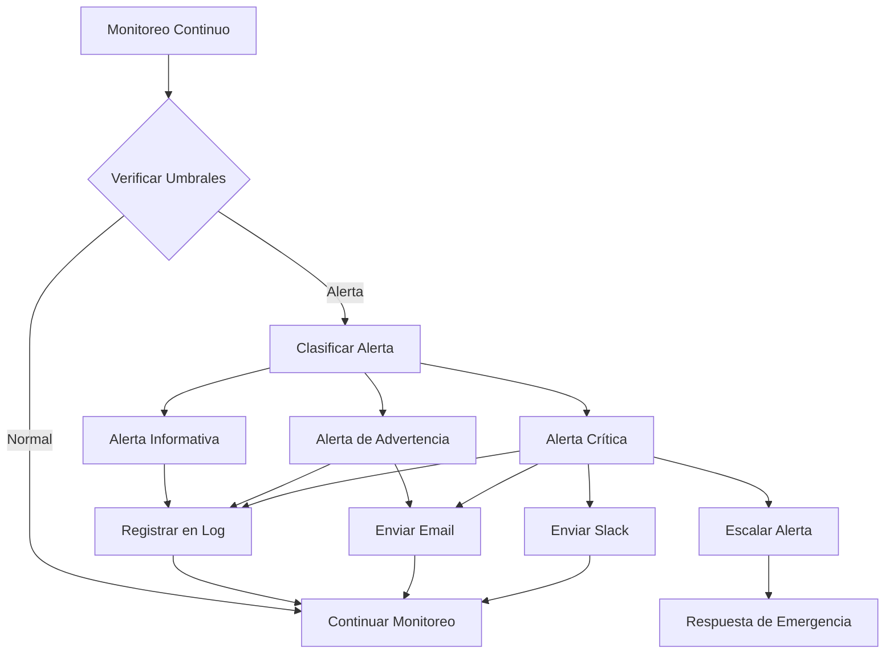

---

## 📝 Conclusión del Flujo

El sistema de flujos del orquestador está diseñado para:

### ✅ **Garantías de Ejecución**
- **Completitud**: Todas las tareas son procesadas o marcadas como fallidas
- **Orden**: Las dependencias son respetadas automáticamente
- **Consistencia**: Los estados son siempre coherentes
- **Durabilidad**: Toda la información crítica es persistida

### 🔄 **Flexibilidad Operacional**
- **Configuración dinámica**: Parámetros ajustables sin reiniciar
- **Escalabilidad**: Fácil adición de nuevos scrapers
- **Recuperación**: Múltiples niveles de recuperación automática
- **Monitoreo**: Visibilidad completa de todos los procesos

### 📊 **Observabilidad Total**
- **Trazabilidad**: Cada operación es registrada y auditable
- **Métricas**: Datos cuantitativos de rendimiento y calidad
- **Alertas**: Notificación proactiva de problemas
- **Reportes**: Análisis histórico y tendencias

Este diseño de flujos asegura que el sistema opera de manera **predecible**, **confiable** y **mantenible**, facilitando tanto la operación diaria como la evolución futura del sistema.
